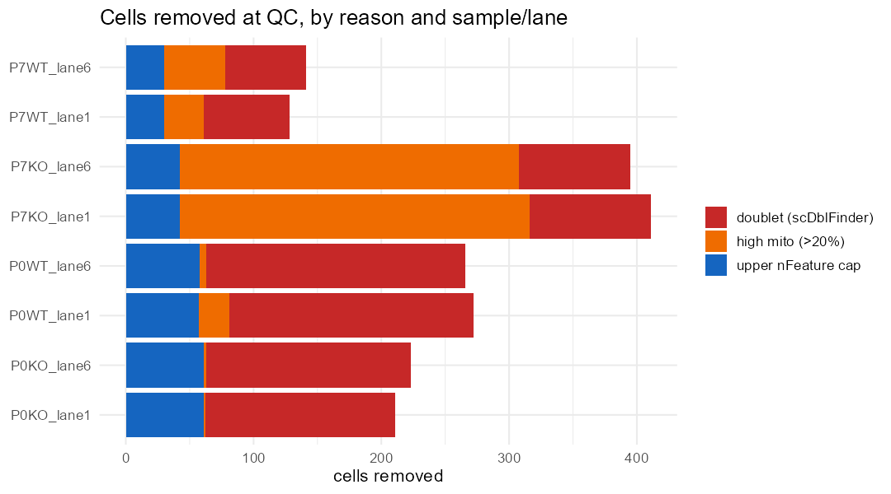
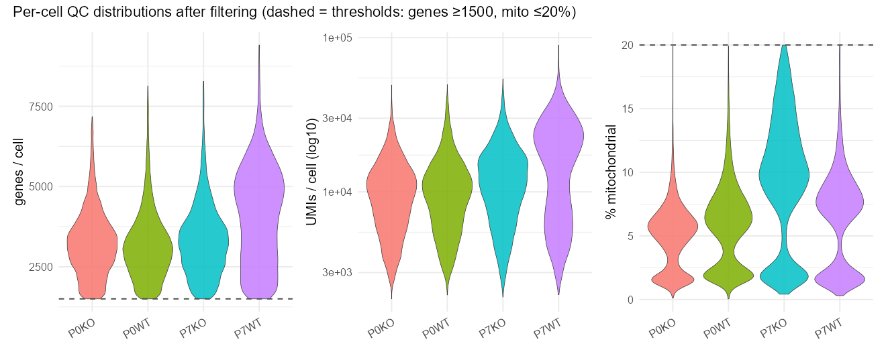
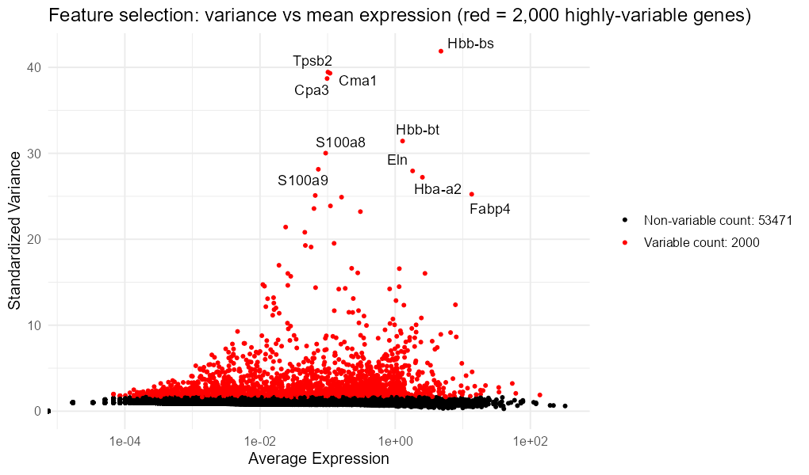
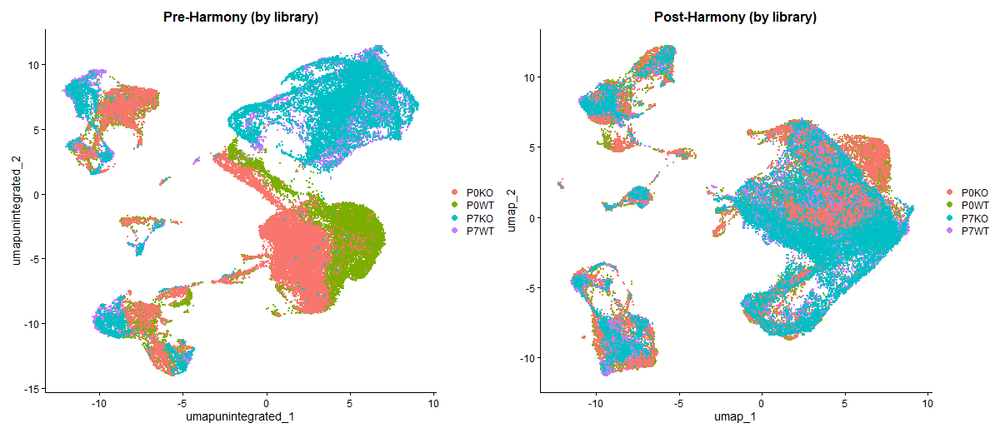
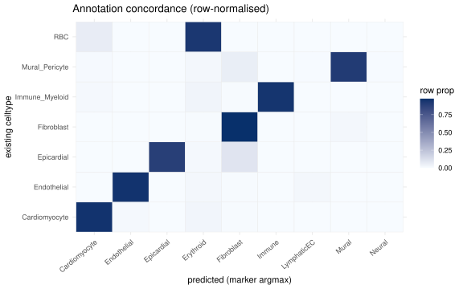

## What you're looking at

**Help → QC & normalization** shows five figures carried inside the data bundle as
embedded images, a per-lane doublet table, and the module-score definitions.
**Help → Annotation check** shows a concordance heatmap between the cell-type labels
the app uses and an independent marker-based prediction.

Both tabs document a stage that happened *before* this repository. That boundary is the
first thing to establish, because it determines which numbers in this chapter are
citable and which are not.

::: {.callout-important}
## Two claims this chapter previously got wrong

Earlier versions of this chapter described the data as **10x** and, after the platform was
corrected, made two further inferences that the upstream run has now disproved. Both are
retracted here rather than quietly edited:

1. **&ldquo;The barcodes were renamed or re-encoded upstream, and the bundle's downsample is an
   alphabetical cut.&rdquo;** Wrong. PIPseeker v3.3 with chemistry V emits exactly these 16 bp
   barcodes, all beginning `AA`, spanning exactly this range &mdash; that is its own whitelist,
   not a transformation of ours. The bundle's barcodes are unmodified PIPseeker barcodes and
   the downsample is not alphabetical.
2. **&ldquo;Ambient RNA is the big one, at &gt; 10 %.&rdquo;** That figure belongs to PIPseq
   **v4**. This run used **chemistry V**, which the same benchmark puts in the
   &lt; 5 % group with every other kit tested. The ambient-RNA argument does not apply.

What survives the correction is narrower and still worth acting on &mdash; see
[the doublet section](#doublet-removal).
:::

::: {.callout-important}
## Known defect: nearly every cell is counted twice, at half depth

This is documented by the upstream team in `our_analysis/00_DOCS/REPLICATES.md` and it is
the single most consequential thing in this chapter. It is **not fixed**.

The two lanes of each library are the same library sequenced twice for depth. Each lane was
counted by a **separate PIPseeker run** and the results then `merge()`d — so the same cell
appears twice, once per lane, each copy carrying about half its true reads. Barcode overlap
between the lanes, from `lane_barcode_overlap.csv`:

| Library | lane1 | lane6 | shared | Jaccard |
|---|---|---|---|---|
| P0WT | 11,245 | 11,534 | 11,216 | 0.970 |
| P0KO | 12,011 | 12,045 | 11,973 | 0.991 |
| P7WT | 5,836 | 5,888 | 5,834 | 0.990 |
| P7KO | 8,241 | 8,220 | 8,201 | 0.993 |

**97–100 %.** Essentially every cell is duplicated. Three consequences:

1. **Cell counts are ~2× inflated.** In the browser bundle, the 30,030 "cells" are
   **22,480 distinct** cells, of which 7,550 appear twice — the 50 % downsample removed one
   copy of most duplicated pairs by chance, which mitigates the inflation without fixing it.
2. **The ≥ 1,500-gene filter was applied to half-depth cells**, so it is far more aggressive
   than it looks — roughly a 3,000-gene threshold in full-depth terms — and it removed cells
   that would have passed at full depth.
3. **Cell-level tests double-count**, on top of n = 1. Wilcoxon p-values are inflated beyond
   what [chapter 3](03-de.qmd) already says about pseudoreplication.

The upstream team's own impact assessment, which is measured rather than asserted: **the
descriptive DE conclusions are robust**, because pseudobulk sums over cells are roughly
conserved whether a cell's reads sit in one row or two. What needs regenerating on properly
combined data is **cell counts, QC thresholds, clustering and UMAP, doublet calls,
composition, and every per-cell readout.**

So, for reading the app: fold changes and gene rankings are usable. **Composition
percentages, cycling fractions, and per-cell module scores are not, to the precision they
appear to have.** That includes the cycling fractions behind the sort-artefact measurement in
[chapter 7](07-fourgroup.qmd).

**The fix is specified and needs the cluster:** re-run PIPseeker once per library over both
lanes' FASTQs (`scripts/recount_combine_lanes.sh`), which concatenates reads and dedupes UMIs
across lanes, then re-run the Seurat pipeline over 4 libraries instead of 8. The FASTQs are on
the cluster, not here. Expect cell counts to roughly halve to their true values.
:::

## The platform, and the pipeline that produced the matrices

The assay is **PIP-seq** with **chemistry V**: cells are captured by mixing them with
barcoded template particles and vortexing into a templated emulsion, rather than by
microfluidic droplet formation. It was Fluent BioSciences' product and is now sold by
Illumina as *Single Cell 3&prime; RNA Prep*. Both PIP-seq and 10x are 3&prime;-biased.

Counting was done with the vendor's own pipeline. Every parameter below is read from the
run's own records in `original_Han_analysis/`, which holds the eight PIPseeker sample
folders we received.

| Step | Tool and setting | Source |
|---|---|---|
| Cell capture | PIP-seq, `--chemistry V` | `run_config.csv` |
| Counting | **PIPseeker v3.3.0**, `pipseeker full` | `run_config.csv` |
| Alignment | **STAR 2.7.6a** (bundled in PIPseeker) | `star/Log.out` |
| Reference | Ensembl **GRCm38** primary assembly + **GTF release 99** | `star/Log.out` |
| Reference bundle | `Refdata_scRNA_MAESTRO_GRCm38_1.2.2` | `pipseeker_scripts.txt` |
| Cell calling | PIPseeker sensitivity, **level 5 used** | `filtered_matrix/sensitivity_5/` |
| Doublets | **Scrublet**, `expected_doublet_rate = 0.08` | `scrublets.py` |

STAR was run with `--alignIntronMin 20 --outFilterMultimapNmax 20 --outFilterMatchNmin 20
--outFilterScoreMin 20 --outFilterIntronMotifs RemoveNoncanonicalUnannotated
--soloMultiMappers Unique`.





### Cell calling: the most consequential upstream choice

PIPseeker does not have a single cell-calling threshold; it emits a *range* of
sensitivities and leaves the choice to the analyst. That choice was made by taking the
matrices from `sensitivity_5` &mdash; the most permissive level computed.



This matters for reading the QC section below. A permissive cell call admits more marginal,
low-content barcodes, which means **the downstream &ge; 1,500-gene floor is doing the real
cell-quality filtering**, not the cell caller. The two decisions have to be read as one:
sensitivity 5 plus a 1,500-gene floor is a different pipeline from sensitivity 3 plus no
floor, even where they return a similar number of cells.

### What the barcodes actually are

PIPseeker's `barcodes.tsv.gz` for a single lane contains 16 bp sequences, **100 %** of which
begin `AA`, with position 3 restricted to A or C and positions 4&ndash;16 uniform. The first
barcode it writes is `AAAAAAAAAAAGCACT`, which is exactly the minimum barcode in our
analysis bundle. The bundle's cell names are `<sample>_<barcode>_<lane>` and its barcodes
are PIPseeker's, unaltered.

So the barcode is a **translated** identifier &mdash; PIPseeker maps the underlying
combinatorial split-pool barcode (24 bp in v2, 28 bp in v3&ndash;v4) into a compact 16 bp
space before writing the matrix. Anyone comparing these barcodes against a published
PIP-seq library structure, or against a 10x whitelist, will find they match neither, and
that is expected rather than alarming.

::: {.callout-note}
## How many principal components? — the **PC dimensions** tab

The gap listed above is now measured rather than left open. Both embeddings carry
`dims = 1:30` into `FindNeighbors` and `RunUMAP` with no recorded justification, so the
sweep in `our_analysis/04_integrate_annotate/pcdims_sweep.R` holds SCTransform, PCA and
Harmony fixed and varies only that cut across 10, 30 and 50 — for the cardiomyocytes and
for the whole heart.

The two objects answer differently, and the difference is the point.

**Cell-type structure is robust.** In the whole heart every annotated type stays a clean,
separate island at all three cuts. The islands rotate and rearrange, but identity holds,
so the cell-type calls do not depend on the PC choice.

**CM subclusters are not.** The cardiomyocyte compartment is one continuous blob at every
cut, and its subclusters are partitions of that continuum rather than discrete
populations. The count moves with the PC cut — **7 at dims 10, 11 at 30, 12 at 50** at
resolution 0.2 — and only **30 % of a cell's 30 nearest neighbours survive** going from 10
PCs to 30. There are no natural boundaries to find, so any small numerical change moves
the cuts.

| | dims 1:10 | **dims 1:30** | dims 1:50 |
|---|---|---|---|
| CM subclusters (res 0.2) | 7 | **11** | 12 |
| 30-NN retained vs dims 30 | 30 % | — | 51 % |
| Cluster ARI vs dims 30 | 0.49 | — | 0.56 |
| Share of top-50 PC variance | 73.4 % | 92.6 % | 100 % |

The variance column is a share of what the **50 computed PCs** hold, not of total variance
— `Stdev()` returns only the components that were computed, so the 50-PC figure is 100 %
by construction and says nothing on its own.

The tab reports neighbour retention rather than a raw distance, deliberately. The
Procrustes RMSD the sweep also records is *n*-dependent: two unrelated embeddings of
42,416 cells score 0.0069, not 1, so an unlabelled 0.003 reads as "almost identical" when
it is 42 % of the way to unrelated.

**What follows for reading the CM deep-dive:** treat subclusters as strata to compare
within, not as cell types. "CM7 is a distinct population" is not supported; "KO differs
from WT within CM7" is the kind of claim the stratification can carry.
<span class="src">our_analysis/04_integrate_annotate/pcdims_sweep.R, pcdims_shape_metrics.R</span>

## One open question in the upstream notes

`preprocessing_scripts/pipseeker_scripts.txt` also contains a **MAESTRO** configuration
block, set up with `--platform 10x-genomics`, a 10x ARC whitelist (`737K-arc-v1.txt`) and a
`--barcode-start 1 --barcode-length 16 --umi-start 17 --umi-length 12` layout. That layout
matches PIPseeker's *barcoded FASTQ* output, so it may have been a parallel attempt run
downstream of PIPseeker's translation &mdash; but a 10x whitelist would not match
PIPseeker's barcode space. The README's account of the chain is
PIPseeker &rarr; `sensitivity_5` &rarr; Seurat, and the Scrublet script reads
`filtered_matrix/sensitivity_5`, so nothing we analyse appears to come through MAESTRO.
Worth one question to the original analyst to confirm it fed nothing.
:::

::: {.callout-warning}
## What is still not in this repository

The upstream *counting* is now fully documented. What remains outside is the **re-analysis
R pipeline** that turns those matrices into the bundle &mdash; `scRNA_lane_merge.Rmd`,
`scRNA_mergeP0.Rmd`, `scRNA_mergeP7.Rmd` and `build_app_data.R`, which
`original_Han_analysis/ORIGINAL_README.md` places in a sibling `our_analysis/` tree. Still
uncited, therefore:

- the number of **principal components** carried into neighbours and UMAP
- **Harmony** settings: `theta`, `lambda`, iterations
- **UMAP** settings: `n.neighbors`, `min.dist`, `metric`
- the whole-object **clustering resolution**, and the cluster &rarr; cell-type mapping
- `SCTransform`'s `variable.features.n` and `vars.to.regress`
- the **upper** gene-count cap (the lower bound is now confirmed &mdash; see below)
- `00_DOCS/NORMALIZATION.md` and `METHODS_COMPARISON.md`, which the same README cites
:::

## The question

Before any biology, four libraries have to be made comparable to each other. Three
things stand in the way in this dataset specifically: heart cells are genuinely
mitochondria-rich (so a standard mitochondrial cutoff throws away real
cardiomyocytes), cardiomyocytes are large and multinucleate-prone (so doublet calling
is unusually load-bearing), and the four libraries were prepared separately (so
library identity is confounded with every biological variable of interest).

## How it was done

### QC filtering

Per lane, keep cells with **≥ 1,500 detected genes** and **≤ 20 % mitochondrial
reads** (mouse `mt-` prefix), plus an upper gene-count cap to drop likely multiplets.

The 1,500-gene floor is no longer taken on trust: the original run's merged objects
(`original_Han_analysis/processing/merge.lanes.*.rds`) have a `nFeature_RNA` **minimum of
exactly 1500** in every one, so the threshold was applied at the lane-merge stage and is
confirmed at source. It removes 13&ndash;27 % of the cells PIPseeker called: P7KO goes from
8,241 + 8,220 barcodes to 7,152 + 7,070 cells, P7WT from 5,836 + 5,888 to 4,715 + 5,019.

The 20 % mitochondrial ceiling is generous by the usual conventions, deliberately:
cardiomyocytes at P0–P7 are packed with mitochondria, and a 5–10 % cut of the kind used
for lymphocytes removes the most metabolically mature cardiomyocytes — precisely the
cells the maturation analysis is about. The cost is that genuinely stressed or dying
cells survive filtering; the mitochondrial-fraction confound in
[chapter 11](11-confounds-repro.qmd) is partly the bill for this choice.

{#fig-qc-filtering}

{#fig-qc-violins}

### Doublet removal {#doublet-removal}

Two-cell partitions were called per lane with **Scrublet**, then cross-checked with
**scDblFinder**, and removed before analysis.

The Scrublet call is now fully specified, and it carries the one live consequence of the
platform correction:

```python
scrub = scr.Scrublet(counts_matrix, expected_doublet_rate=0.08)
doublet_scores, predicted_doublets = scrub.scrub_doublets(
    min_counts=2, min_cells=3, min_gene_variability_pctl=85, n_prin_comps=30)
```
<span class="src">original_Han_analysis/preprocessing_scripts/scrublets.py</span>

**`expected_doublet_rate = 0.08` is a 10x-loading prior.** The benchmark puts PIPseq V
multiplets at **3.6 %** &mdash; the lowest of seven platforms tested, because templated
emulsification does not overload the way a chip does. So the prior handed to Scrublet was
roughly twice the rate this chemistry actually produces, and Scrublet still flagged only
**1.28&ndash;1.34 %** of cells in the original objects. Re-running with a prior set from the
confirmed chemistry is the cheapest open item in this chapter.

One further difference between the two runs, visible in the objects: **the original run
flagged doublets without removing them** &mdash; `merge.lanes.*.rds` carry `doublet` and
`doublet_score` columns with both `True` and `False` cells present. Removal was added by
the re-analysis, which is one of the QC fixes `ORIGINAL_README.md` lists.



{#fig-qc-doublets}

The two callers disagree roughly four-fold — Scrublet at **1.3–2.1 %** per lane,
scDblFinder at **5.0–7.7 %** — and on this chemistry it is scDblFinder that looks
mis-calibrated: its range sits above the platform's measured multiplet rate while
Scrublet's sits below it. Both columns ship in the bundle so the disagreement stays
visible rather than being settled silently.

### Normalization and feature selection

**SCTransform** with the **glmGamPoi** method — a regularised negative-binomial
variance-stabilising transform, so cells sequenced to different depths become
comparable without a fixed size-factor assumption. Roughly **2,000** highly variable
genes drive the dimensionality reduction.

**Mitochondrial percentage was deliberately not regressed out** — and this is now citable
rather than inferred. `our_analysis/00_DOCS/METHODS_COMPARISON.md:25` records that the
*original* run used `SCTransform(vars.to.regress = "percent.mt")` and the current one uses
`SCTransform(method = "glmGamPoi")` with **no** `vars.to.regress`. In a tissue where
mitochondrial content *is* the maturation phenotype, regressing it out removes signal, not
noise. Other parameters now recoverable from the same scripts: `dims = 1:30`,
clustering `resolution = 0.8`, and `nfeatures = 2000` for variable-feature selection.

{#fig-qc-hvg}

### Integration

The four libraries were integrated with **Harmony**, then clustered and embedded as the
UMAP the app shows.

{#fig-qc-harmony}

This is the step with the most leverage on everything downstream, and the one whose
parameters are least recoverable here. With one animal per library, library identity
and genotype are the same variable: integrating "over libraries" and integrating "over
genotypes" are not separable operations in this design. Harmony was run over the four
libraries, which mixes them in the embedding — and by construction that also removes
some part of the genuine genotype difference from the embedding. The consequence is
worth stating plainly: **the UMAP is for orientation, not for measuring genotype
effects.** Every KO-vs-WT number in this book is computed on expression values, never
on integrated coordinates.

### Cell-type annotation

The seven cell-type labels — Cardiomyocyte, Endothelial, Epicardial, Fibroblast,
Immune_Myeloid, Mural_Pericyte, RBC — arrive in the bundle already assigned, by
marker-based manual annotation upstream. The curated marker panels the app offers in
its "Gene set" quick-picks (`shiny_app/app.R:55-77`) were copied from that pipeline and
are the canonical mouse-heart sets: `Tnnt2`/`Myh6`/`Actc1`/`Ttn` for cardiomyocytes,
`Col1a1`/`Dcn`/`Pdgfra` for fibroblasts, `Pecam1`/`Cdh5`/`Kdr` for endothelium,
`Ptprc`/`Cd68`/`Lyz2` for immune cells, `Rgs5`/`Pdgfrb`/`Acta2` for mural cells.

Because the assignment itself is not in this repo, `shiny_app/build_refmap.R` provides
an independent check of it. For each cell it scores nine published-style marker panels
as module scores, takes the **argmax** panel as a "predicted" lineage, and
cross-tabulates that against the label the app uses. Confidence per cell is the
**margin** between the top and runner-up panel score. Panels with fewer than two genes
present are dropped before scoring.



{#fig-refmap}



## What it shows

**The cell accounting, end to end.** Each stage can now be counted rather than estimated:

| Stage | Cells | Source |
|---|---|---|
| PIPseeker barcodes called (sensitivity 5, 8 lanes) | **75,020** | `metrics_summary.csv` |
| after the ≥ 1,500-gene floor, at lane merge | **60,938** | `merge.lanes.*.rds` |
| after the remaining QC (mito cap, doublet removal) | ~58,900 | the re-analysis |
| bundled for the browser | **30,030** | `app$meta` |

The merged objects give 17,522 (P0KO), 19,460 (P0WT), 14,222 (P7KO) and 9,734 (P7WT) — so
the gene floor alone removes about 19 % of what PIPseeker called, and the bundle carries
roughly half of what survived QC.


The diagonal dominates: **95.7 %** of cells labelled Cardiomyocyte are predicted
Cardiomyocyte, 95.7 % for Endothelial, 89.2 % for Epicardial. The largest off-diagonal
block is cardiomyocytes predicted Erythroid (**2.5 %**), which is the signature of
ambient haemoglobin mRNA in a highly vascular tissue rather than a mis-annotation —
`Hba-a1`/`Hbb-bs` are among the most abundant transcripts in the dissociation
supernatant, and a four-gene erythroid panel is easily won by ambient contamination.
The annotation is sound at the resolution the app uses it.

## What our re-analysis changed

The hand-off README says the original R scripts were edited by us for &ldquo;QC correctness
fixes &mdash; doublet removal, mouse mito QC, marker-based cardiac selection, pseudobulk DE,
portable paths&rdquo;, and points at a `METHODS_COMPARISON.md` that is not in this tree. That
is a claim, not a record. It can be checked.

The original run's merged objects (`original_Han_analysis/processing/merge.lanes.*.rds`) carry
one row per cell, named by barcode and lane. Our bundle's cells carry the same names with a
sample prefix. So every cell the original kept can be looked up in ours, and what we did to
it inferred from whether it survived.



::: {.callout-tip}
## Two different kinds of subtraction in one table

The table above mixes **filters** with a **sample**, and the difference matters:

- `minus_doublets` and `minus_mito_over_20` are **quality filters**. Those cells are judged
  unusable and are gone from the analysis.
- `minus_not_bundled` is the **browser downsample** — a stratified ~50 % sample taken so the
  Shiny app loads a 120 MB file it can hold in memory. No cell here was judged unusable, and
  they all still exist in the upstream objects.

So for P0KO: 17,522 cells, minus 309 doublets, minus 3 over the mito cap, leaves 17,210
eligible — and 8,507 of those were not carried into the browser bundle, leaving 8,703. Nothing
is unaccounted for.
:::

::: {.callout-important}
## The downsample is not free, and it is not only cosmetic

It would be convenient to say the downsample affects only what the browser draws. That is not
true, and the bundle is explicit enough to show why: **the four-group DE grids are computed
from the bundle**, so they inherit it.

- `app$fourgroup$de2` uses all **21,598** bundled cardiomyocytes — roughly half of the
  ~43,000 that passed QC upstream
- `app$fourgroup$de` uses the broad matrix's **5,755** cardiomyocytes — about **13 %** of them

Every arm size in [chapter 7](07-fourgroup.qmd) is therefore about half, or an eighth, of what
the data could support. That is a large part of why CM2's KO-P0 arm is 31 cells rather than
~60, why four contrasts are skipped outright, and why the twelve priority contrasts need two
grids to reach full coverage. **Re-running the four-group analysis from the full post-QC
objects would roughly double every arm** and would likely recover several of the skipped
contrasts — the single highest-value change available to this project without new tissue.

One related claim cannot be checked from here. The app states that the precomputed cell-type
and subcluster DE tables were "computed from the FULL data"
(`shiny_app/app.R`, About tab). Those tables carry `baseMean` but **no per-arm cell counts**,
so nothing in the bundle corroborates it either way. Treat it as the intent of the upstream
run, not as a verified fact, until `our_analysis/` arrives.
:::

### Why not put all the cells in the bundle?

The decision is made by `build_app_data.R`, which is not in this repository, so **the reason
is not recorded anywhere citable.** What can be measured is what it buys, and that turns out
to settle the question in a more useful way.

| Slot | In memory |
|---|---|
| `deg_expr` — broad matrix, 24,221 × 8,026 | **314 MB** |
| `expr` — curated panel, 2,181 × 30,030 | **164 MB** |
| all analysis results (`tables`, `fourgroup`, `enrich`, `geneinfo`, `meta`) | 139 MB |
| **whole bundle** | **634 MB** (115 MB gzipped on disk) |

The app holds all of that in one R process, which serves every session
(`DOCKER.md`, "Concurrency"), and reads it at startup in ~11 s. Doubling the cells would put
the two matrices near **956 MB** and the bundle over **1 GB** — above the per-instance memory
of the shinyapps.io tiers this is deployed to. So the constraint is real, even if the specific
threshold that motivated it was never written down.

::: {.callout-tip}
## The two questions are separable

"Should the browser hold all the cells?" and "should the analysis use all the cells?" are not
the same question, and the numbers above show why: **the display matrices are 75 % of the
footprint, and the analysis results are cell-count independent.** A DE table is genes × eight
columns whether it was computed from 5,755 cells or 43,000.

So the bundle can stay at 115 MB *and* every precomputed contrast can use every cell — by
computing upstream on the full annotated object and shipping only the result tables. Only the
genuinely interactive analyses (the *Subset & DEGs* tab, which runs `presto` on demand) need
cells in the bundle at all, and those can stay on the 8,026-cell matrix without affecting
anything precomputed.

`build_fourgroup.R` already has the flag for this: `--seurat=<path>` computes over all genes
and all cells from the upstream object. What is missing is the annotated post-QC object, in
`our_analysis/`.
:::



Four things follow, and the first is the one that matters most.

**We did not re-count anything.** All 30,030 of our cells are present in the original
objects — 8,703 of 8,703 for P0KO, and so on for each sample. Both runs read the same
PIPseeker `sensitivity_5` matrices. Nothing downstream of this is explained by a different
alignment, a different reference, or a different cell call.

**Doublet removal is real and categorical.** Scrublet-flagged doublets are retained at
**0.0 %** — not one of the 1,015 flagged cells is in our bundle — while unflagged cells are
retained at ~50 %. The original run *flagged* doublets and kept them; we remove them. This is
the clearest example of the difference between the two runs being a genuine QC decision
rather than a byproduct.

**The 20 % mitochondrial cap is ours, and its effect is very uneven.** The original applied
no cap at all: its cells run up to **36.0 %** mitochondrial. Ours retains **0.0 %** of cells
above 20 %. But look at where those cells come from:

| Sample | cells removed by the mito cap | share of the sample |
|---|---|---|
| P0KO | 3 | 0.0 % |
| P0WT | 29 | 0.1 % |
| P7WT | 74 | 0.8 % |
| **P7KO** | **538** | **3.8 %** |

::: {.callout-important}
## The mito cap and the mito confound are the same phenomenon

P7KO is the library with the highest mitochondrial content
([the upstream metrics](#tbl-mito-source) put it at 9.98 % against 5&ndash;7 % for the
others), so a fixed 20 % ceiling removes far more of its cells than of any other's. Two
consequences worth stating in the same breath:

- our QC **partially suppresses** the confound, by deleting its most extreme cells &mdash;
  which is why the residual `mt-` shift in the DE tables (+0.34 log2 in CM1) is smaller than
  the raw per-library difference
- the surviving P7KO population is therefore **mildly selected** on mitochondrial content in
  a way the other three are not

Neither is a reason to raise the cap. It is a reason not to treat the four groups as
symmetrically filtered when reading a marginal result.
:::

**The upper gene bound is graded, not a threshold.** Retention is flat at ~52 % up to about
7,000 genes, then falls: 38 % at 7&ndash;7.5k, 36 % at 7.5&ndash;8k, 13 % at 8&ndash;9k,
2.5 % at 9&ndash;10k, and 0 % above 10,000. The highest-complexity cell we keep has 9,307
genes. That shape is what a quantile- or MAD-based rule produces, not a fixed number — which
is consistent with the value never having been written down, because there may not be a
single value to write.

**Everything else is a uniform downsample.** Once doublets, cells over 20 % mitochondrial and
the very-high-complexity tail are set aside, retention is **50.6 &ndash; 50.7 %** in all four
samples. That is a stratified 50 % downsample, exactly as the bundle documentation claims,
and it lays to rest the alphabetical-cut theory retracted at the top of this chapter.

What this comparison **cannot** speak to are the other two changes the README lists —
marker-based cardiac selection and pseudobulk DE. Those are analysis choices downstream of
cell filtering, and settling them needs the `our_analysis/` scripts.

## Why this way

**Why a marker-concordance check rather than reference mapping?** Seurat anchor-based
label transfer, SingleR or Azimuth would all give a probabilistic call against a real
reference atlas, which is strictly better evidence. All three need either the source
Seurat object or an external reference object; the bundle has neither (it holds
matrices and data frames, not a Seurat object, and the app never loads Seurat). A
marker-panel argmax over the curated matrix is what can actually be computed from what
is here. It is labelled as such in the app — the tab is called "Annotation check", not
"Label transfer" — and its purpose is to catch a gross mis-annotation, which it is
adequate for.

**Why the same `module_score()` as the signature scores?** `build_refmap.R:49-66` is a
copy of `build_signature_scores.R:102-120` — deliberately the same function, same
`nbin = 24`, `ctrl = 100`, `seed = 1`. If the annotation check used a different scoring
rule than the biology scores, a disagreement between them would be uninterpretable.

## What it cannot say

- **Nothing about upstream parameter choices** beyond the values listed above. If a
  reviewer asks how many PCs were used, the honest answer today is "recorded in the
  other workspace".
- **The doublet rate is not resolved**, only bracketed. Both callers' numbers ship; the
  analysis was run on the cells that survived the pipeline's own choice.
- **The concordance check is not independent of the curated panel.** It scores markers
  that exist in `app$expr`, which was itself selected around these cell types. It can
  detect a badly mixed cluster; it cannot detect a cell type nobody looked for.

## Reproduce it

```bash
# The annotation check (rewrites the bundle in place, backing up first):
Rscript shiny_app/build_refmap.R

# The QC figures and doublet table come from the upstream pipeline and travel
# inside the bundle; this book only decodes them:
docs/export.sh --only='qc-|refmap|tbl-doublet'
```
