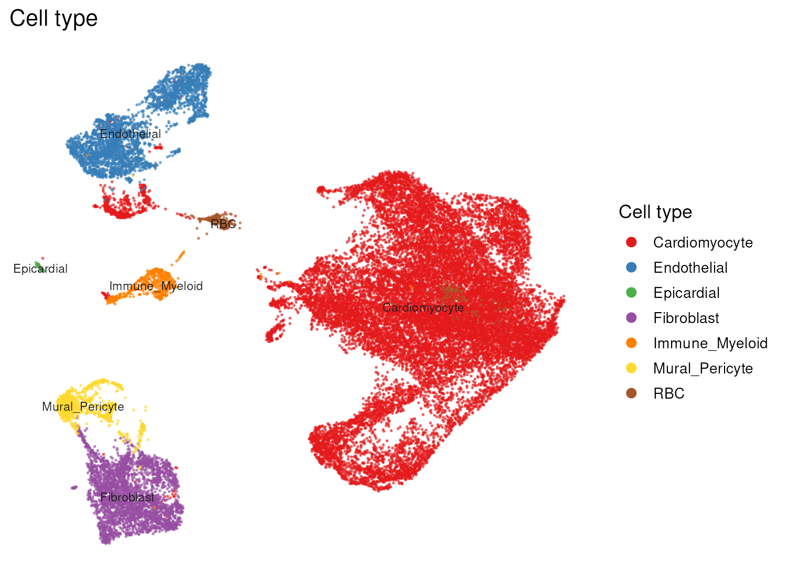
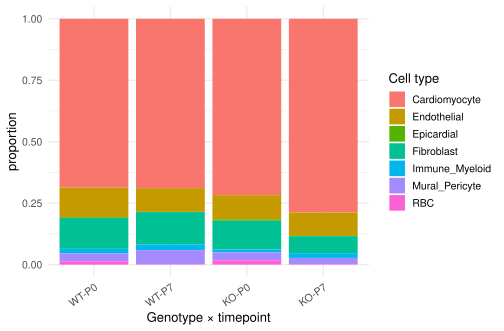
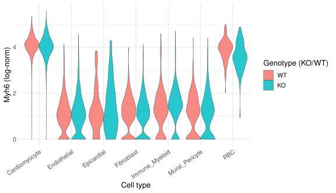
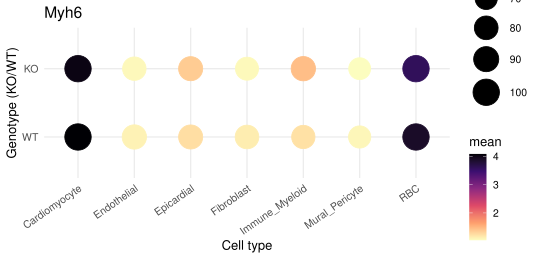
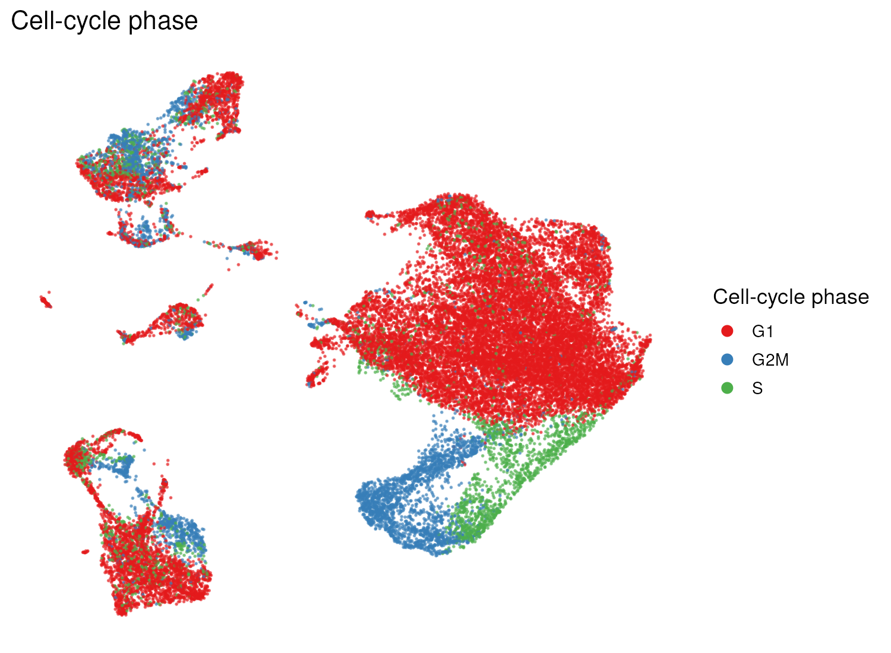
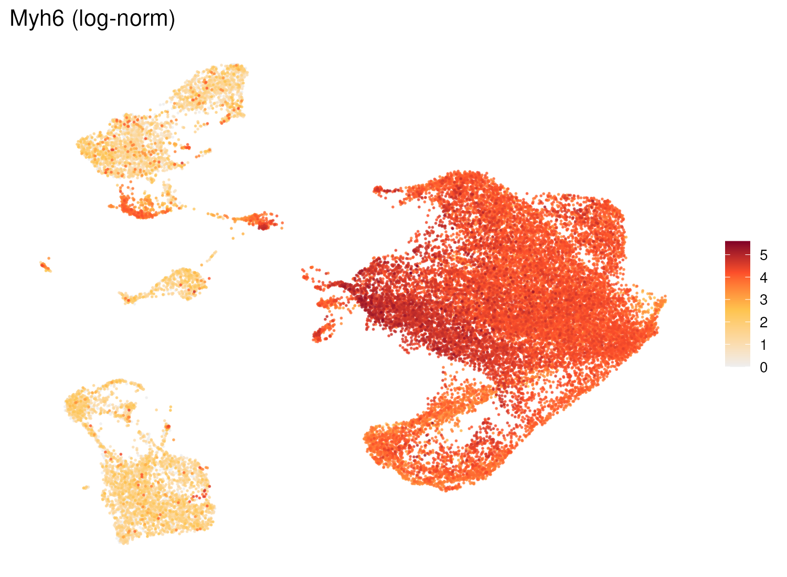

## What you're looking at

The app's first three tabs. **UMAP explorer** colours ~30,000 cells by any gene or
metadata column, optionally splitting into side-by-side panels. **Gene detail** shows
one gene as a violin plot and a dot plot across any grouping. **Composition** stacks
cell-type proportions across samples, genotypes or timepoints.

{#fig-umap-celltype}

## The question

These tabs answer "what is in this dataset, and where does gene X sit in it". They are
navigation, not inference — but they are also where a reader forms their first
impression of effect sizes, so how they are built matters more than their simplicity
suggests.

## How it was done

### Two expression matrices, and why



Neither matrix dominates, so the bundle carries both. `expr_vec()`
(`shiny_app/app.R:115-121`) resolves a gene against the curated panel first and falls
back to the broad matrix; cells absent from the broad subset come back `NA` and render
grey. The UMAP title says which path was taken, so a sparser-looking map is never
mistaken for lower expression:

```r
expr_vec <- function(gene, cells) {
  if (in_panel(gene)) { ... return from app$expr (all 30,030 cells) }
  if (gene %in% rownames(EXPR)) { ... return from app$deg_expr (8,026 cells) }
  setNames(rep(NA_real_, length(cells)), cells)   # grey
}
```

There are therefore **two** downsamples between the sequencer and these plots: the
bundle itself is a stratified sample of the upstream object, and the genome-wide matrix
inside it is sampled again. Any cell count read off these tabs is a count *in the
bundle*.

### The plots themselves

| Panel | How the number is computed | Source |
|---|---|---|
| UMAP, categorical | one WebGL trace per level; centroid labels at the per-level median of UMAP1/UMAP2; hovering a cell highlights every cell of that level via a crosstalk group | `app.R:435-463` |
| UMAP, continuous | points sorted by value so high-expressing cells draw last (on top), 4-stop colour scale | `app.R:465-472` |
| UMAP, split | one panel per level of the split variable, colour legend and colourbar drawn once, shared axes | `app.R:475-506` |
| Violin | `geom_violin(scale = "width", trim = TRUE)` on log-normalised expression | `app.R:2856-2872` |
| Dot plot | size = % of cells with expression > 0; colour = mean log-normalised expression, over the same cells | `app.R:2877-2890` |
| Composition | `prop.table(table(x, fill), margin = 1)` — proportions *within* each x group, so bars always sum to 1 | `app.R:2905-2914` |

{#fig-comp}

{#fig-gene-violin}

{#fig-gene-dot}

## What it shows

Cardiomyocytes are 69–79 % of cells depending on group, which is what a whole-heart
dissociation at P0–P7 gives when the sort was for cycling cells rather than for a
lineage. The composition bars are the reason the rest of the book is mostly about
cardiomyocytes: no other compartment has the cell numbers to support a per-subcluster
contrast in this design.

{#fig-umap-phase}

{#fig-umap-gene}

The cell-cycle map is worth a second look, because it is the visual form of the confound
that shapes [chapter 7](07-fourgroup.qmd): the cycling cells are not scattered evenly
through the atlas, and their density differs between the two timepoints for a reason
that is partly the FACS sort rather than biology.

## Why this way

**Why proportions within each group, not raw counts?** The four libraries recovered
different numbers of cells (see the doublet table in
[chapter 1](01-upstream.qmd)), and P7 was sorted while P0 essentially was not. A raw
stacked count chart mostly displays library size. `margin = 1` normalises it away. The
cost is that a composition bar cannot tell you a population *grew* — only that its
share changed — and with n = 1 per condition that is the only honest reading anyway.

**Why "% expressing" and "mean expression" as separate visual channels?** In sparse
single-cell data a rise in mean expression can come from more cells expressing the gene
or from the same cells expressing it harder, and those are different biological claims.
Splitting them across size and colour keeps them separable. This distinction returns as
a load-bearing methodological point in [chapter 9](09-overlaps.qmd), where a gene that
quadruples its detection rate carries a log2 fold change of only 0.16.

**Why hover-to-highlight rather than click-to-select?** With 30,000 overplotted points,
finding all cells of one cluster by eye is impossible, and a click that lands between
points reads as "deselect". The crosstalk group at `app.R:451-462` highlights the whole
level on hover and clears on unhover — including a JS handler for the click-on-nothing
case, because crosstalk cannot fire on un-hover by itself.

**Why the UMAP is not a measurement.** The embedding was computed after Harmony
integration over the four libraries, and with one animal per library that operation
cannot distinguish library from genotype. Genotype differences are therefore partly
removed from the coordinates by construction. The app colours the map by genotype
because it is useful for orientation; the number that answers "does the KO differ" comes
from [chapter 3](03-de.qmd) onward, computed on expression, never on coordinates.

## What it cannot say

- **Cell counts here are bundle counts**, not experiment counts, at two removes from
  the original object.
- **A grey cell is not a zero.** It means the gene is not in the curated panel and that
  cell is not in the 8,026-cell broad subset.
- **Composition shifts are not population dynamics.** Sorting, dissociation bias
  (cardiomyocytes at P7 are large and fragile) and n = 1 all sit between a bar height
  and a claim about the tissue.
- **Distance on the UMAP is not quantitative**, and after integration it is not even
  reliably qualitative between genotypes.

## Reproduce it

```bash
# in the app
shiny::runApp("shiny_app")     # UMAP explorer / Gene detail / Composition

# the figures in this chapter
docs/export.sh --only='umap-|comp-|gene-|tbl-matrices'
```
