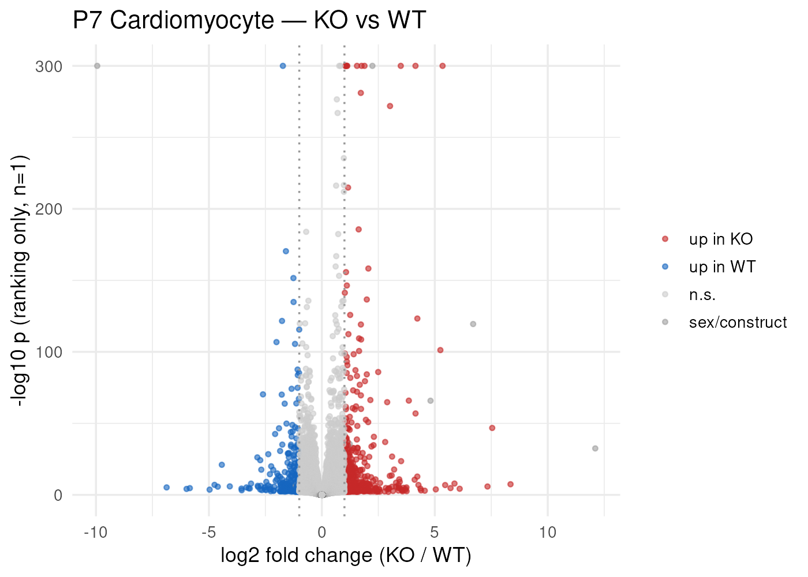
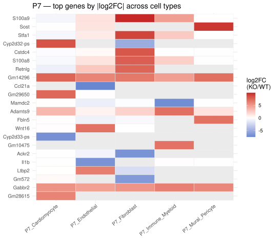

## What you're looking at

**Differential expression → DE by cell type** shows a precomputed KO-vs-WT contrast
within one cell type at one timepoint, as a linked volcano plot, table and gene card,
plus a heatmap of the top genes across all cell types. **Subset & DEGs** computes a
contrast live: filter cells by any categorical column, choose a variable to split on
and two sets of levels, press *Compute DEGs*.

{#fig-de-volcano}

## The question

"Which genes differ between the knockout and the wild type, within a comparable
population of cells?" Everything downstream — enrichment, the four-group grids, every
gene-set overlap — is built on the answer, so the choice of test propagates further
than any other decision in this project.

## How it was done

Every differential-expression result in this project, precomputed or live, comes from
the same core:

```r
res <- presto::wilcoxauc(X, grp)     # X = log-normalised counts, grp = A / B
res <- res[res$group == "A", ]       # logFC > 0  =>  up in group A
data.frame(gene = res$feature, log2FoldChange = res$logFC,
           pvalue = res$pval, padj = res$padj,
           pct_A = round(res$pct_in, 1), pct_B = round(res$pct_out, 1),
           confounder = res$feature %in% CONF, n_A = nA, n_B = nB)
```
<span class="src">shiny_app/app.R:674-700 — `deg_compute()`</span>

The same call, with the same column names, appears in `build_fourgroup.R` (`de_one()`)
and in `analysis/2026-08-21_email/01_de.R`. That is deliberate: three code paths
produce DE tables in this project, and `tools/test_downloads.R` asserts that the two
the app exposes return byte-identical tables for the same cluster × contrast ×
stratum. A caveat that applies to one and not the others would be worse than none.

| Parameter | Value | Where |
|---|---|---|
| Test | Wilcoxon rank-sum, **cell-level**, on log-normalised expression | `presto::wilcoxauc` |
| Effect size | `logFC` = difference of mean log-normalised expression; `auc` = rank-based | `presto` |
| Minimum cells | **10 per arm**, hard floor | `app.R:690`, `build_fourgroup.R:74` |
| Multiple testing | Benjamini–Hochberg (`padj`) | `presto` |
| Confounders | 7 sex/construct genes flagged, never removed | `app$confound` |
| Volcano colour threshold | `\|log2FC\| ≥ 1` counts as up/down, else `n.s.` | `app.R:138-144` |
| p-axis floor | `-log10(pmax(p, 1e-300))` | `app.R:139`, `app.R:198` |
| Table order | descending `\|log2FC\|`, never by p | `app.R:197` |
| Heatmap | top 22 genes by max `\|log2FC\|` across groups; confounders excluded from the ranking | `app.R:381-398` |





{#fig-de-lfcheat}

### The live tab

**Subset & DEGs** runs the identical computation on demand over the broad matrix. Cells
are filtered to a mask (`deg_mask()`, `app.R:663-673`), split into two level-sets, and
handed to `presto`. It exists because the precomputed grid cannot anticipate every
question — "KO vs WT among G1 cardiomyocytes in CM2 at P7" is four filters deep, and
enumerating that space in advance would be a bundle larger than the data.

## Why this way

**Why Wilcoxon rather than a negative-binomial model (DESeq2, edgeR, MAST)?** Because
with **n = 1 animal per condition** there is no biological replicate structure for a
parametric model to estimate dispersion from. A pseudobulk DESeq2 run on four samples
with one animal each would produce confident-looking p-values from a design that cannot
support them — the model's assumptions would be doing the work, invisibly. A rank-based
test makes the same limitation, but nakedly: it produces an effect size (AUC) that is
interpretable per cell, and a p-value that everyone can see is pseudoreplicated.

**Why AUC is carried alongside log2FC.** `presto`'s `logFC` is a difference of mean
log-normalised expression, so it scales with expression level. On this data that is not
a subtlety: between WT P0 and P7, `Mcm3` goes from 6.6 % to 27.2 % detection for a
log2FC of **0.16**, while `Myh7` moves **2.5**. A symmetric `|log2FC|` cut therefore
sorts maturation genes and can essentially never classify a cell-cycle gene — it would
report "no cell-cycle genes change", which is false. AUC is rank-based and scale-free,
so one threshold means the same thing for both. [Chapter 9](09-overlaps.qmd) shows both
measures side by side for the same gene lists.

**Why the p-axis is floored, and labelled as ranking-only.** Pseudoreplication makes the
variance estimate far too small, so p-values underflow to zero in double precision.
Flooring at `1e-300` puts those points in a visible row at the top of the volcano; the
axis label says "ranking only, n=1" (`app.R:154`) so a point pinned at 300 is read as
"smaller than a double can hold", not as a significance level.

**Why confounders are flagged rather than dropped.** The seven sex/construct genes are
the honest top of the KO-up list. Deleting them would produce a cleaner table that
silently hides the design's biggest problem; colouring them grey and labelling them
`sex/construct` (`app.R:133-144`) keeps the problem in the reader's eye while excluding
them from every enrichment input, where they would otherwise drag in
spermatogenesis-flavoured GO terms.

**Why the heatmap ranks on max `|log2FC|` and not on significance.** With p-values that
cannot be compared across tables of different sizes, "top genes" has to mean top by
effect. Confounders are excluded from the ranking (`app.R:388`) so the same seven genes
do not occupy a third of every heatmap.

## What it cannot say

- **No p-value here is a significance statement.** Ranking only. This is not
  conservatism; it is what n = 1 permits.
- **A gene absent from a table was not necessarily unchanged.** The precomputed
  four-group tables are row-gated (see [chapter 7](07-fourgroup.qmd)); the cell-type
  tables above are not, but they are computed over the matrix they were built from.
- **The live tab is limited to the 8,026-cell broad matrix**, so a four-filter-deep
  question can easily fall below the 10-cell floor. The app says which arm ran out of
  cells rather than returning an empty plot.
- **KO-vs-WT is animal-vs-animal.** See [the caveats](index.qmd#read-this-first).

## Reproduce it

```bash
# precomputed tables: built upstream into app$tables$ct_DE
# live tab: shiny::runApp("shiny_app") -> Differential expression -> Subset & DEGs
# complete, ungated tables for the two headline contrasts:
analysis/2026-08-21_email/run.sh

docs/export.sh --only='de-volcano|de-lfcheat|tbl-de'
```
