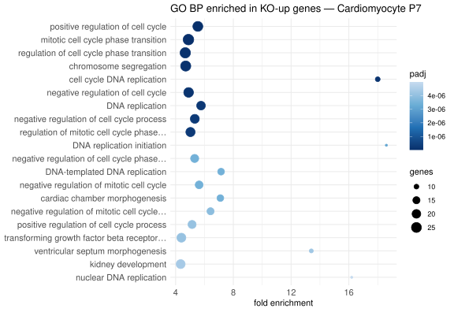
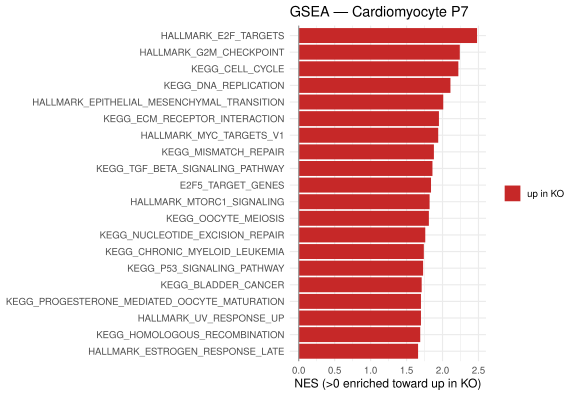
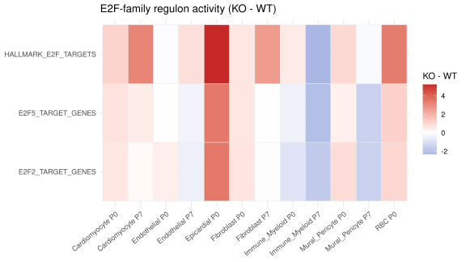
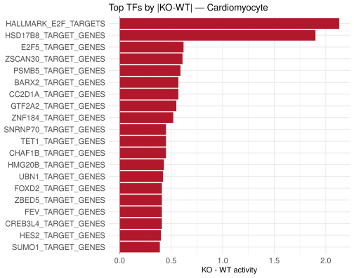

## What you're looking at

**Differential expression → Pathways & enrichment**, three sub-panels: *GSEA pathways*
(a signed bar plot of normalised enrichment scores), *GO biological process* (a dot plot
of fold enrichment against adjusted p), and *TF / regulon activity* (an E2F-family
heatmap of KO−WT activity plus the top transcription factors for a cell type).

{#fig-enr-go}

{#fig-enr-gsea}

## The question

A gene list of several hundred rows is not a result anyone can hold in their head. GO
and GSEA compress it into named programs — but both are extremely sensitive to
decisions the plot does not display: which genes went in, what they were tested
*against*, and how hard the threshold was. This chapter is mostly about those three.

::: {.callout-note}
## Provenance of this tab

The cell-type-level tables behind these three panels (`app$enrich$gsea`,
`app$enrich$go`, `app$enrich$tf`) were computed **upstream**, by the same workspace that
built the bundle — the enrichment scripts referenced in `README.md:57-63`. The
per-subcluster enrichment ([chapter 5](05-cm-deepdive.qmd)) and the four-group
enrichment ([chapter 7](07-fourgroup.qmd)) are in this repository and fully
parameterised, and the in-repo builders state that they match the cell-type build's
recipe (`build_subcluster_enrichment.R:59-60`). The parameter table below is therefore
citable for the in-repo runs; for the cell-type panels it is the documented intent
rather than a line of code in this tree.

The **TF / regulon activity** panel is upstream-only. The bundle carries
`app$tables$e2f_regulon` (per cell type × timepoint KO−WT activity) and `app$enrich$tf`
(per cell type × genotype mean activity per TF), which is the output shape of a
regulon-scoring method in the DoRothEA/decoupleR family, but neither the method nor its
regulon set is recorded in this repository. Treat that panel as indicative and do not
quote a method for it.
:::

## How it was done

### The three regimes, and why they differ



That table is the single most useful thing in this chapter. The same tab label can sit
above results produced at very different stringency, and comparing term counts across
regimes is meaningless.

### GO

```r
enrichGO(gene = genes, OrgDb = org.Mm.eg.db, keyType = "SYMBOL", ont = ont,
         universe = unique(universe), pAdjustMethod = "BH",
         pvalueCutoff = GO_PCUT, qvalueCutoff = GO_QCUT,
         minGSSize = 10, maxGSSize = 500, readable = FALSE)
```
<span class="src">shiny_app/build_fourgroup_enrichment.R:80-86 · same call at build_subcluster_enrichment.R:69-78</span>

Set-size bounds are `10 ≤ size ≤ 500` throughout. Terms smaller than 10 genes are
noise-dominated in a list of this size; terms larger than 500 ("cellular process",
"metabolic process") are true of any gene list and crowd out the specific ones.

**Both directions are enriched separately.** A single test on the union of up- and
down-regulated genes returns terms that are enriched in *change*, which is rarely the
question. Every GO panel in the app has a *GO — up* and a *GO — down* view for this
reason.

### GSEA

```r
stat <- sign(d$log2FoldChange) * -log10(pmax(d$pvalue, 1e-300))
fgsea(pathways, stat, minSize = 10, maxSize = 500)   # Hallmark + C2 CP:KEGG_LEGACY, mouse
```
<span class="src">shiny_app/build_subcluster_enrichment.R:102-112</span>

Ranking is by **signed −log10 p**, not by log2FC. It requires at least 15 ranked genes,
uses `set.seed(1)`, and draws its gene sets from MSigDB mouse Hallmark plus
`C2 CP:KEGG_LEGACY`.

### The universe

For the in-repo runs the universe is **recomputed from the expression matrix**: genes
detected in ≥ 5 % of the cells of at least one arm of that specific contrast, cluster
and stratum — about 11,000 genes, where the row-gated DE table would have supplied
roughly 3,000.

This is the most consequential single line in the enrichment code. `app$fourgroup$de` is
gated (expressed in ≥ 5 % of one arm **and** (`padj < 0.05` **or** `|log2FC| ≥ 0.5`)), so
it has already discarded most expressed-but-unchanging genes — which is precisely the
background a hypergeometric test needs. Using it as the universe inflates every fold
enrichment, because the denominator has been pre-enriched for the same signal as the
numerator. <span class="src">build_fourgroup_enrichment.R:28-37</span>

### When a list is too small to test

`pick_genes()` (`build_fourgroup_enrichment.R:53-66`) walks a three-rung ladder and
**records which rung fired**:

1. `padj < 0.05` and `sign × log2FC ≥ 0.25`
2. `padj < 0.05`, any log2FC in that direction
3. top 200 by `|log2FC|` in that direction — **not significance-filtered**

If even rung 3 is under 10 genes, nothing is tested and that is recorded too. The
alternative — an empty panel — conflates "we tested and nothing passed" with "there was
nothing to test", and those are opposite readings of the same blank space.

### The TF panels

{#fig-enr-e2f}

{#fig-enr-tf}

## Why this way

**Why `keyType = "SYMBOL"` rather than mapping to Entrez first?** Symbol mapping loses
some genes to synonyms, but an Entrez round-trip loses genes *silently and
asymmetrically* — and it would have to be applied to the universe as well as the input,
where a partial mapping biases fold enrichment. Keeping symbols end-to-end means the
universe and the input are drawn from exactly the same namespace.

**Why two different `pvalueCutoff` regimes rather than one?** They answer different
questions. `build_subcluster_enrichment.R` is an exploratory screen over thirteen small
per-subcluster lists, where a 0.05 cutoff returns nothing for most clusters and the
useful output is a ranked list of candidate themes — so it runs at 0.2/0.2 and is
labelled permissive. The contrast-specific runs and the collaborator deliverable are
meant to be quoted, so they run at 0.05/0.2. Merging the two into one compromise
threshold would make the screen useless and the quotable result soft.

**Why GO *and* GSEA?** GO tests a thresholded list against a background and answers "is
this list unusual"; GSEA uses the whole ranking and answers "is this pathway
coordinately shifted". On a design where the threshold is the weakest link, having one
method that does not depend on it is worth the extra build time. Where they disagree,
the disagreement is usually the threshold, and that is diagnostic.

**Why Hallmark + KEGG_LEGACY specifically?** Hallmark sets are curated to be
non-redundant, which keeps the bar plot readable; KEGG_LEGACY adds metabolic pathway
structure, which this project's maturation/metabolism question needs. Reactome and GO-BP
gene sets were left out of GSEA because they overlap heavily with each other and with
the GO panel next to them, producing a bar plot of near-duplicate rows.

## What it cannot say

- **The TF / regulon panel has no documented method in this repository.** Do not quote
  it as evidence; use it to generate a hypothesis and then check the underlying genes.
- **Enrichment inherits every DE caveat.** The input lists were selected with
  pseudoreplicated p-values, so a q-value on a GO term is a ranking device at two
  removes.
- **Mitochondrially-encoded genes drive the headline oxidative terms** in the KO-up
  direction. [Chapter 11](11-confounds-repro.qmd) quantifies this: removing `mt-` genes
  from both input and universe costs one cluster's KO-up result all 61 of its terms.
- **Term counts are not comparable across the three regimes** in the table above.

## Reproduce it

```bash
# in-repo enrichment builders (each rewrites app_data.rds, backing up first)
Rscript shiny_app/build_subcluster_enrichment.R
Rscript shiny_app/build_fourgroup_enrichment.R --probe   # sizes only, writes nothing
Rscript shiny_app/build_fourgroup_enrichment.R           # ~2 h, ~460 enrichGO calls

# the audited standalone run, with the mito sensitivity analysis
analysis/2026-08-21_email/run.sh

docs/export.sh --only='enr-'
```
