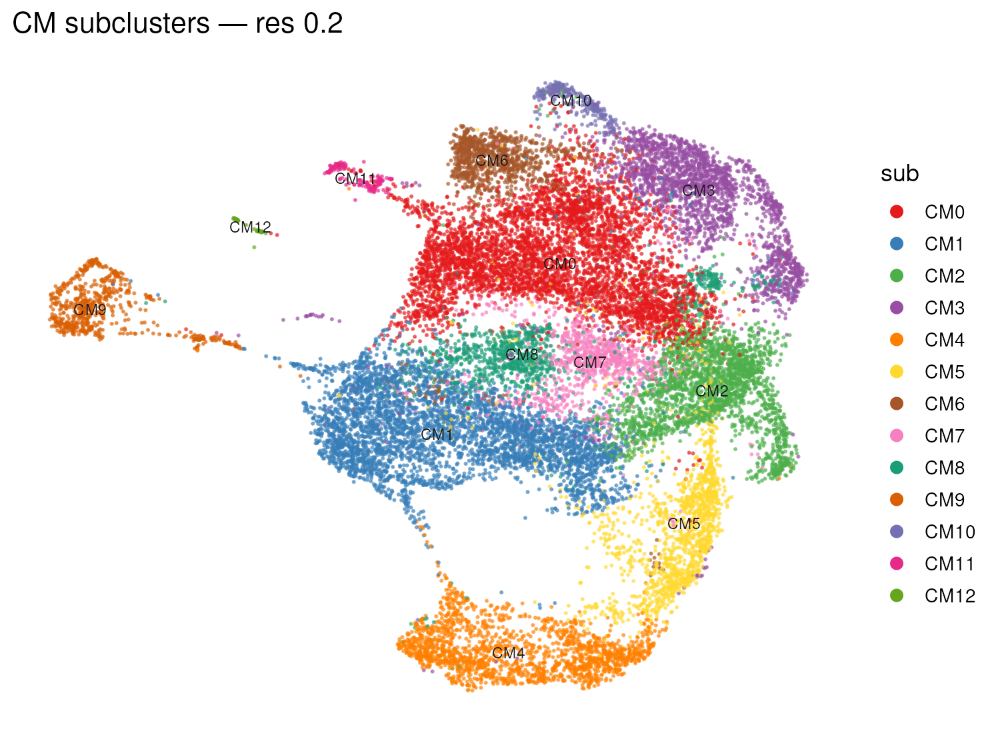
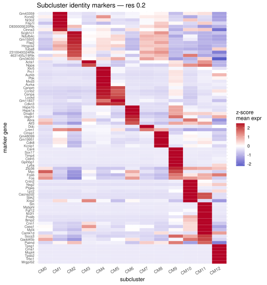
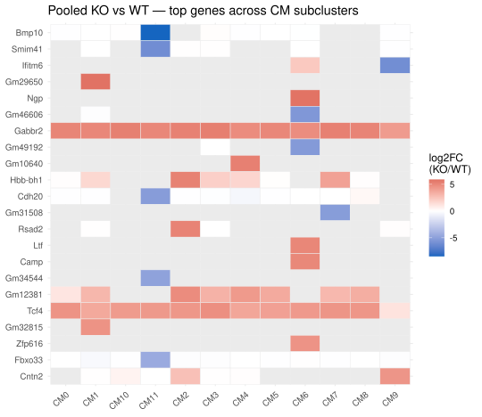
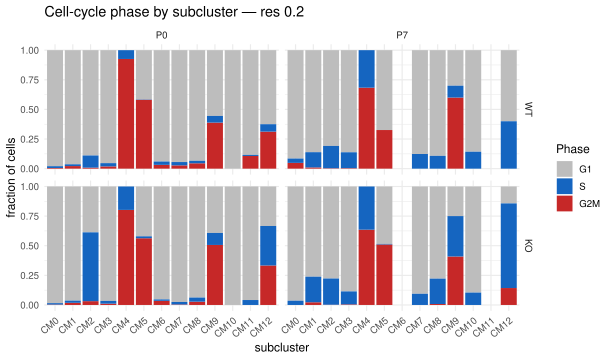

## What you're looking at

**Cardiomyocytes → Cardiomyocyte deep-dive**, eight sub-tabs over a genuine
re-clustering of the cardiomyocyte compartment: *Subcluster map*, *Identity (marker
heatmap)*, *DE (per subcluster)*, *Cell cycle*, *Composition*, *Per-cluster summary*,
*Top markers*, and *Subcluster enrichment*.

{#fig-cm-umap}

## The question

Cardiomyocytes are 69–79 % of the cells here, and treating them as one population
throws away the structure the project is actually about — some subpopulations are
cycling, some are maturing, and the knockout may act on one and not the other. The
deep-dive exists to ask every question from [chapter 3](03-de.qmd) again *within* a
cardiomyocyte state rather than across all of them.

## How it was done

Cardiomyocytes were re-clustered on their own, upstream, at three Louvain resolutions
(0.1, 0.2, 0.3, stored as `SCT_snn_res.*` columns on `app$cm$meta`). **Only resolution
0.2 is exposed** — 13 subclusters, CM0–CM12 — and every in-repo builder hard-codes
`RES <- "0.2"` (`build_subcluster_enrichment.R:37`, `build_fourgroup.R:73`) so nothing
downstream can silently be computed at a different granularity than the map shows.

### Identity

Two independent lines of evidence, deliberately:

**Curated marker heatmap** — z-scored mean expression of a curated marker panel across
subclusters, precomputed upstream into `app$heat[["res0.2"]]`, plus a
`nearest_CM_subtype` label per subcluster.

{#fig-cm-markerheat}



**Data-driven identity markers** — `presto::wilcoxauc` one-vs-rest on the broad matrix
restricted to cardiomyocytes, keeping `auc > 0.55 & padj < 0.05 & logFC > 0`, taking the
**top 150 by AUC**, and running GO BP on them. Clusters under **25 cells** are skipped,
which drops CM12 (9 cells).
<span class="src">build_subcluster_enrichment.R:41-46, 120-160</span>



### Differential expression within a subcluster

The *DE (per subcluster)* panel's *Comparison* dropdown carries two different kinds of
table:

- **pooled KO-vs-WT** — `app$tables$sub_DE[["res0.2"]]`, KO versus WT with P0 and P7
  **pooled**, built upstream
- **the four timepoint-specific contrasts** — read from `app$fourgroup$de` / `$de2`, the
  same grids the Four-group tab uses ([chapter 7](07-fourgroup.qmd))

{#fig-cm-lfcheat}

A detail that trips people up, and that the app says out loud
(`README.md:230-234`): the *Split map by* control next to the comparison dropdown
facets **the map only**. The pooled `sub_DE` tables had their timepoint dimension
collapsed at build time, so no display-time split can recover a per-timepoint contrast
from them. That is exactly why the comparison is a separate dropdown rather than a
facet — a facet would imply the split was applied to the statistics.

### Cell cycle and composition

Phase calls (`G1`/`S`/`G2M`) come from Seurat `CellCycleScoring` with the
Tirosh/Regev 43-gene S and 54-gene G2/M lists, title-cased for mouse, run upstream. The
phase panel shows the fraction of each phase within each subcluster × genotype ×
timepoint cell — `prop.table` over every margin except phase.

{#fig-cm-phase}

### Subcluster enrichment

Pooled KO-vs-WT GO and GSEA per subcluster, from `app$enrich$sub`:

| Parameter | Value |
|---|---|
| Gene lists | `\|log2FC\| ≥ 1` **and** `padj < 0.05`, confounders excluded, directions separate |
| GO | `enrichGO`, BP, `pvalueCutoff = 0.2`, `qvalueCutoff = 0.2`, size 10–500 |
| Universe | the genes present in that subcluster's DE table |
| GSEA | `fgsea`, Hallmark + KEGG_LEGACY, ranked by `sign(log2FC) × −log10(p)`, ≥ 15 genes |
| Identity GO | top 150 markers by AUC (`auc > 0.55`, `padj < 0.05`), min 25 cells |

<span class="src">shiny_app/build_subcluster_enrichment.R:37-46</span>

## What it shows

Thirteen subclusters, but they are not thirteen usable analytical units. **CM6 has zero
P7 cells. CM4 has zero G1 cells** — it is entirely S/G2M, so it has no phase-matched
table anywhere in the project. CM0 has 82 WT-P7 and 167 KO-P7 cells. Several conclusions
in the app are restricted to CM1, CM2, CM3, CM5, CM7 and CM8 for exactly this reason, and
the four-group counts table in [chapter 7](07-fourgroup.qmd) is the audit behind that
restriction.

### CM12 is not cardiomyocytes {#cm12}

**CM12 has no differential expression, and it should not be in this compartment at all.**
It is 99 cells — 0.23 % of the 42,416 — and they are immune cells.

**91 % of CM12 cells carry pan-leukocyte markers** (at least two of `Ptprc`, `Cd52`,
`Laptm5`, `Coro1a`, `Cd3e`, `Trbc1`, `Cd79a`). Across 3,000 randomly sampled
cardiomyocytes that figure is **0 %**. Its one-vs-rest markers are mast-cell tryptases and
chymase — `Tpsg1`, `Cma1`, `Mcpt4`, `Tpsb2`, `Tpsab1`, `Cpa3`, `Mrgprb2`, `Fcer1a` — at
log2FC 13–15 with `pct.2` ≈ 0. About 44 % are mast cells specifically; the remainder are
other leukocytes, T cells among them.

They are **not doublets**: all 98 are `is_doublet = FALSE` from Scrublet, and they carry
*half* the RNA of a cardiomyocyte (5,505 vs 11,742 counts) and a third the mitochondrial
content (2.1 % vs 7.5 %) — doublets have more, not less. Small immune cells beside large,
mitochondria-rich cardiomyocytes.

They do show cardiomyocyte genes, and that is what fooled the annotation: a CM panel score
of **1.198** against **3.380** for real cardiomyocytes. About a third the level, which is
what ambient RNA looks like in a tissue that is 70 % cardiomyocyte.

**How the label happened.** `annotate.R:43-46` scores nine marker panels per cell, averages
them **per whole-heart cluster**, takes `max.col`, and gives every cell in the cluster that
label — there is no per-cell decision. The clustering itself worked: these cells form
whole-heart cluster 27, of which they are 74 %. What failed is that **none of the nine
panels describes them**. The only immune panel is
`Immune_Myeloid = Ptprc, Cd68, Lyz2, C1qa, Csf1r`, and four of those five are macrophage
genes that mast cells and T cells do not express, so it scores 0.236 — fifth place. With
ambient RNA at 1.198, Cardiomyocyte wins by 5×. `max.col` has no minimum score and no
`Unassigned` option, so the question is a forced multiple choice with no correct answer.

The cross-check that would have caught this never ran. `annotate.R:4` names SingleR against
celldex's `MouseRNAseqData`, a reference that does contain immune subtypes;
`annotation_cluster_labels.csv` records `singleR = NA` for all 28 clusters because `celldex`
was not installed and lines 12-13 and 33 skip it with a message.

**The mundane reason there is no DE**, separately — and it is *not* that CM12 lacks KO
cells. It has 36 of them against 63 WT, which is why the composition bars show it as about
38 % KO. The pseudobulk contrast never looks at cells: it aggregates them into one sample
per library × lane, needs **20 cells in each**, and then two KO and two WT surviving samples
to estimate dispersion. Ninety-nine cells do not survive an eight-way split:

| sample | cells | |
|---|---|---|
| P0KO lane1 | 10 | dropped |
| P0KO lane6 | 10 | dropped |
| P0WT lane1 | 18 | dropped — two cells short |
| **P0WT lane6** | **21** | **passes** |
| P7KO lane1 | 8 | dropped |
| P7KO lane6 | 8 | dropped |
| P7WT lane1 | 10 | dropped |
| P7WT lane6 | 14 | dropped |

One sample of eight. So `n_KO_samp = 0` in the summary table means *no KO pseudobulk sample
reached 20 cells*, not *no KO cells* — a distinction worth spelling out, because the two
readings sit next to each other in the app and look contradictory.

It is a threshold effect, not an asymmetry: the largest KO samples hold 10 cells each, so a
floor of 10 rather than 20 would give two KO and four WT samples and DESeq2 would run. It
would also be running on 8–10 cells per sample, and on "replicates" that are the same animal
sequenced twice (see [chapter 1](01-upstream.qmd)) — so it would produce numbers rather than
evidence. The skip is recorded as `skipped_too_few_or_unbalanced` rather than silently
absent, which is how the gap was noticed at all.

**What the app shows instead.** Recording the skip in a table is not the same as surfacing
it. Because CM12 had no entry in `sub_DE`, it was missing from the DE panel's subcluster
dropdown altogether — so the panel did not read as "no result for CM12", it read as though
CM12 did not exist. It is now offered, marked *not testable (ranking only)*, and selecting
it swaps the volcano for a cell-level Wilcoxon ranking
(`our_analysis/05_analyses/cm_subcluster_celllevel_de.R`, carried into the bundle by
`shiny_app/build_celllevel_de.R`) with the sample counts that caused the skip stated above
it.

That ranking is **not** a test and the panel says so twice. All 36 KO cells come from two
animals, so they are 36 measurements of two mice; Wilcoxon does not know that and reports
significance in proportion to cell count. The p-values are pseudoreplicated and must not be
quoted — the column to read is `auc`, the effect size that does not inflate with *n*. The
downloaded file is named `celllevel_RANKING_not_a_test_...` so the caveat survives leaving
the app. And since CM12 is immune contamination, any difference in it is a difference
between *immune* cells: the genes that say so are flagged in `immune_gene`, and the panel
warns against reading them as cardiomyocyte biology.

**What this does and does not affect — measured, not assumed.** Flagging every
pan-leukocyte-positive cell in the compartment (161 of 42,416, 0.38 %) and recomputing:
the CM cycling fraction goes from **21.4 % to 21.3 %**. The flagged cells do cycle at
**46.4 %**, more than twice the compartment, but at 0.38 % of it they move the aggregate by
a tenth of a percentage point. An earlier draft of this section claimed the contamination
"would inflate any cycling statistic computed across all CM subclusters"; that is wrong at
the aggregate level and is corrected here.

What *is* wrong is narrower and still worth knowing: CM12's own **47 % cycling** row is not
a cardiomyocyte number at all — it is the immune cells' cycling rate wearing a CM label —
and the subcluster is listed as *Ventricular* in the subtype table above. Nothing else
moves: 0.23 % cannot shift a pseudobulk fold change, and CM12 never had DE to be wrong.

A second thing the flag revealed: the contamination is **not confined to CM12**. The
isolating cluster holds only 55 % of flagged cells at dims 30 and 63 % at dims 50, and at
dims 10 no cluster is more than half flagged — the remainder are dispersed through
otherwise-real CM subclusters, where no clustering separates them. That is why the flag in
the app is per-cell and marker-based rather than a dropped cluster id.

The same population is isolated by every
labelling at dims ≥ 30 (Jaccard 1.000 across resolutions, 0.976 against this one) and by
none at dims 10, which is the exception to the rule that CM subclusters are cuts through a
continuum: this one is a genuinely discrete island, because it is a different cell type.
<span class="src">annotate.R:12-13, 33, 43-46; our_analysis/_common.R CELLTYPE_MARKERS</span>

## Why this way

**Why resolution 0.2 and not a finer one?** With one animal per condition, the binding
constraint is cells per arm per cluster, not resolution. At 0.2 the median subcluster
still supports a four-way split into WT/KO × P0/P7; at 0.3 more of those arms fall
under the 10-cell floor and the number of contrasts that simply cannot be computed
grows faster than the biological resolution gained. Exposing one resolution rather than
a slider is a related choice: a reader comparing a result at 0.2 with a result at 0.3
would be comparing two different sets of cells with the same names.

**Why two independent identity methods?** The curated heatmap tells you whether a
subcluster matches a subtype someone already named; the one-vs-rest AUC markers tell you
what actually distinguishes it in this dataset. When a cluster's curated label and its
data-driven markers disagree, that is the interesting case — most often a
cycling-state cluster that spans subtypes, which a curated subtype panel cannot express.

**Why the pooled and per-timepoint tables live under one dropdown.** They answer
different questions and the pooled one cannot answer the timepoint-specific one, so the
alternative to a shared dropdown is two similar-looking tabs. `tools/test_downloads.R`
asserts that the deep-dive and the Four-group tab return **identical** tables for the
same cluster × contrast × stratum × matrix — if that test ever fails, one of the two
tabs is answering a different question than its label claims.

## What it cannot say

- **Subclusters are not cell types.** They are states in a continuum, cut at a chosen
  resolution; the boundaries are not biological objects.
- **A subcluster's KO-vs-WT result is not independent** of its neighbours' — clustering
  and DE were run on the same cells, so a gene that defines a cluster is favoured to
  appear in its contrasts.
- **CM4 has no phase-matched answer at all**, and CM6 no P7 answer. Where the app drops
  them it names them rather than quietly computing over the rest.
- **The pooled KO-vs-WT tables average over P0 and P7**, which for any gene that moves
  developmentally is a mixture, not an effect.

## Reproduce it

```bash
Rscript shiny_app/build_subcluster_enrichment.R    # app$enrich$sub
Rscript shiny_app/build_fourgroup.R                # the per-timepoint contrasts
Rscript tools/test_downloads.R                     # asserts the two tabs agree

docs/export.sh --only='cm-|tbl-cm'
```

## Choosing a different labelling — the **Variant explorer** sub-tab

Chapter 1 shows that the subcluster count is a function of the PC cut, so the labelling is
a choice rather than a fact. The *Variant explorer* under this tab makes it selectable: a
registry of nine labellings (three PC cuts x three resolutions), and the downstream numbers
follow whichever is picked.

What recomputes and what is looked up is decided by what the deployed app image can run —
it carries `presto` and `Matrix` and nothing else:

- **Live, on switch:** cluster markers (`presto::wilcoxauc`, ~3 s for a whole variant),
  composition by genotype, and cell-cycle phase.
- **Precomputed offline:** pseudobulk KO-vs-WT DE and GO/GSEA, because DESeq2 and
  clusterProfiler are not in the runtime image.

Three of the nine variants carry the full downstream; the rest are marked *(labels only)*
and say so where a table would be. Selecting anything other than production shows a red
banner, and it says explicitly that **subcluster IDs are not comparable across variants** —
CM3 under one labelling is not CM3 under another.

One result is worth recording because it survives the whole exercise: **Gabbr2 is top
KO-up in every testable subcluster of every variant** (7/7, 10/10, 11/11). That is a
whole-compartment effect independent of the clustering, which is exactly the kind of claim
that remains safe when the labels themselves are unstable.
<span class="src">our_analysis/05_analyses/cm_subcluster_analyze.R, shiny_app/build_clusterings.R</span>
