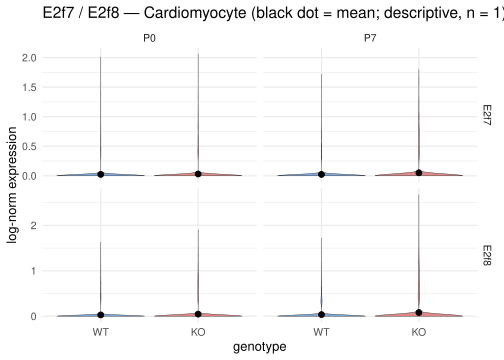
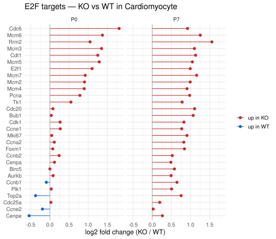

## What you're looking at

**Cardiomyocytes → E2F focus**, two sub-tabs: *E2f7 / E2f8* (expression by genotype ×
timepoint) and *Downstream targets — KO vs WT* (per-gene log2 fold change for a chosen
gene set, as a lollipop plot).

This is the shortest chapter in the book and the most important one to read before any
other result.

## The question

The dataset is labelled "E2F7/8 knockout versus wild type". Before interpreting a single
downstream difference, the obvious check: **is the knockout visible in the data?**

## How it was done

Expression of `E2f7` and `E2f8` per cell, drawn through `expr_vec()` so the curated
panel is used where possible, split by genotype and timepoint, with the group mean
marked. <span class="src">shiny_app/app.R:3362-3391</span>

{#fig-e2f-violin}

Detection rate and mean expression for the same cells, computed directly from the
matrix:



The downstream panel takes a curated gene set (`E2F targets`, 29 genes; `Cell cycle S`;
`Cell cycle G2/M`; and others from `GENE_SETS`, `app.R:55-77`), looks each gene up in
the precomputed cell-type DE tables for P0 and P7, and draws its log2 fold change.

{#fig-e2f-targets}

## What it shows

**The knockout is not detectable at the transcript level, and at P7 the direction is
inverted.** `E2f8` is detected in **10.2 %** of KO-P7 cardiomyocytes versus **6.62 %**
of WT-P7, with a higher mean; `E2f7` is 9.72 % versus 6.64 %. Whatever the allele does,
these cells do not show less `E2f7`/`E2f8` mRNA than the wild-type cells — they show
slightly more.

There are three explanations, and this dataset cannot separate them:

1. **A conditional allele a 3′-biased assay cannot see.** If the targeting removes an
   internal exon or inserts a cassette upstream of the 3′ end, 10x reads pile up in the
   final exon and count the transcript as present. The protein can be absent while the
   3′ signal is intact. This is the most likely explanation and is what the app states.
2. **Incomplete recombination.** If Cre activity is partial, the cells sequenced are a
   mixture and the population mean is diluted toward wild type — but that would produce
   *no difference*, not a higher signal.
3. **The labels are wrong.** Sample swap or mis-genotyping. Nothing in this dataset
   excludes it, and the sex confound (the two animals are different sexes) means
   genotype cannot be verified from the expression data independently of the animal.

The right response is not to discard the dataset — the four libraries plainly differ in
biologically coherent ways — but to be exact about what "KO" names here. **In this book
"KO" means "the animal labelled KO", and every KO-vs-WT difference is a
between-animal difference** that may or may not be caused by loss of E2F7/8 function.

## Why this way

**Why show a negative control this prominently?** Because it is the one result that
changes how every other result should be read, and because a knockout that cannot be
seen in the data is exactly the kind of thing that gets mentioned once in a methods
appendix and then forgotten by the time a figure is being discussed. It has its own tab
in the app and its own chapter here for that reason.

**Why a curated target set rather than a data-driven one?** A data-driven E2F target
list would be derived from *this* data, so testing it against this data's KO-vs-WT
contrast is circular — the genes would be selected for moving and then reported as
moving. The curated sets come from the upstream pipeline's `_common.R` and are fixed
independently of the result.

**Why a lollipop plot rather than a heatmap?** Twenty-nine genes at two timepoints is
small enough that the individual effect size and its sign are the interesting things,
and a lollipop keeps a zero line visible. A heatmap of the same data would encode sign
in a colour scale and make "which of these actually moved, and by how much" harder to
read.

## What it cannot say

- **Nothing about E2F7/8 protein or function.** RNA only, and the RNA does not show the
  knockout.
- **Nothing causal about the target genes.** A target that moves may be responding to
  the genotype, to the sex difference, to the sort, or to a library effect.
- **The direction of the E2f7/E2f8 difference itself should not be interpreted.**
  It is a between-animal difference of a few percentage points in detection rate on a
  sparsely detected gene, in a design with no replication.

## Reproduce it

```bash
# in the app: Cardiomyocytes -> E2F focus
docs/export.sh --only='e2f'
```
