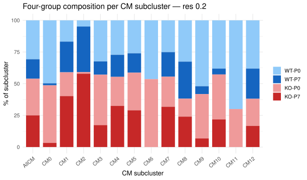
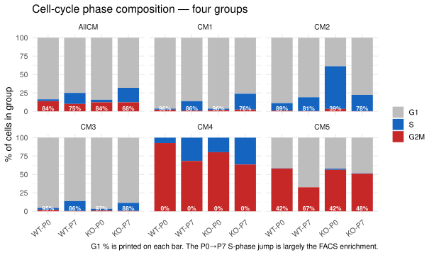
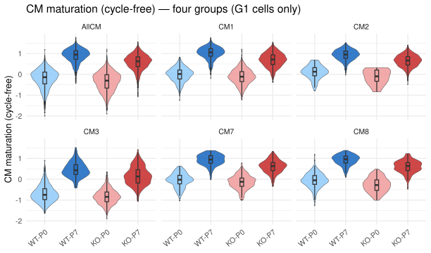
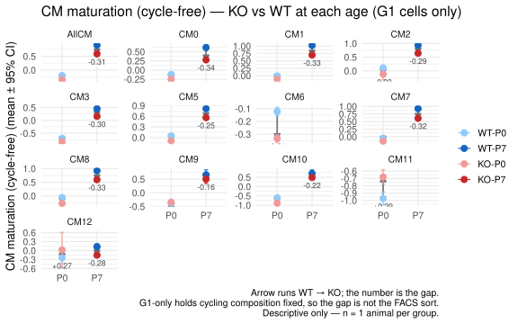
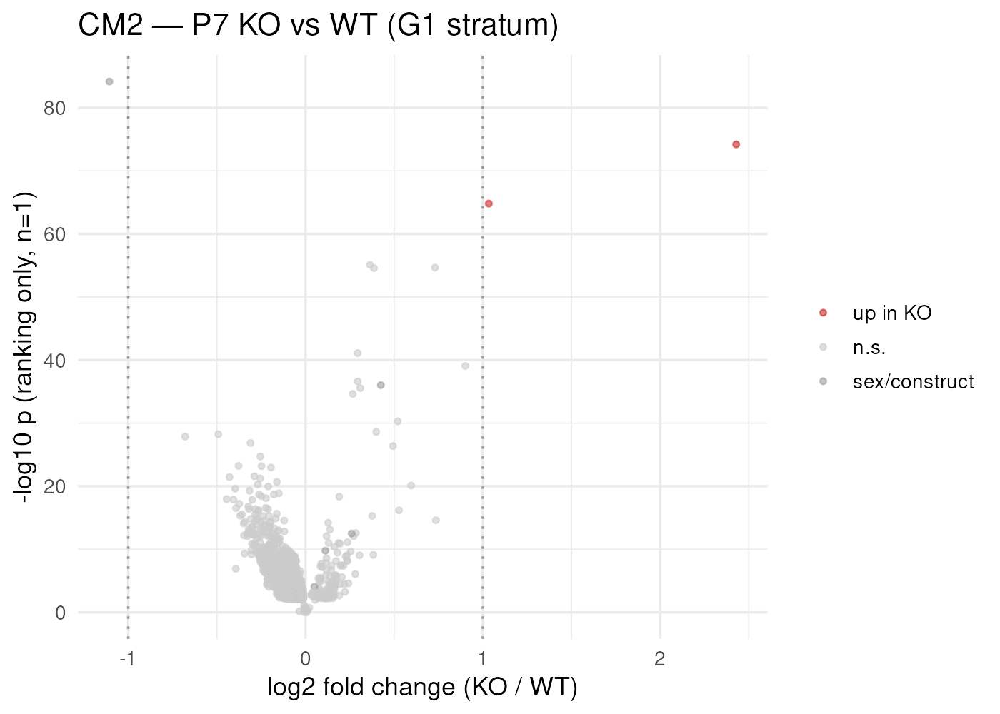

## What you're looking at

**Cardiomyocytes → Four-group (WT/KO × P0/P7)**, four sub-tabs: *Group sizes* (with an
underpowered-arm audit), *Four-group DE*, *G1 & maturation*, and *Enrichment*.

This is the analytical core of the project. The other tabs describe the dataset; this
one is built around the two confounds that would otherwise produce clean-looking wrong
answers.

## The question

The experiment has a 2 × 2 structure — genotype (WT, KO) × age (P0, P7) — and the
biological question is an interaction: *does the knockout change how cardiomyocytes
mature between P0 and P7?* Two things make that harder than it sounds.

First, a pooled KO-vs-WT contrast (the one behind
[chapter 5](05-cm-deepdive.qmd)'s pooled tables) averages over P0 and P7, so it cannot
answer "what changes in the KO **at P7**". Second, a raw P0-vs-P7 contrast is
contaminated by the sort: P7 was FACS-enriched for cycling cells and P0 essentially was
not, so the raw comparison reads out the sort as much as development.

## How it was done

### Four groups, four contrasts, two strata



Each contrast is computed twice: in the **`G1` stratum** (phase-matched — only G1 cells
from both arms, the app's default) and in the **`all` stratum** (raw, labelled
sort-confounded in the UI). Contrasts 1 and 2 are the within-genotype temporal
comparisons; contrast 3 is the headline and the only sort-clean one, because both its
arms are P7; contrast 4 exists to answer "is this change P7-specific?" rather than
because anyone asked for it. <span class="src">build_fourgroup.R:101-112</span>

Multiply by 14 cluster units (AllCM + CM0–CM12) and the grid is 4 × 2 × 14 = 112
possible tables, of which **77 have enough cells to compute**.

### Parameters



| Rule | Value | Why |
|---|---|---|
| `MIN_CELLS` | **10** per arm, hard floor | same floor as the live DE tab, so the two cannot disagree |
| `THIN_CELLS` | **50** per arm, soft floor | computed but flagged "thin in G1" rather than hidden |
| Row gate | `max(pct_A, pct_B) ≥ 5 %` **and** (`padj < 0.05` **or** `\|log2FC\| ≥ 0.5`) | keeps 77 tables to a shippable size |
| `KEEP_ALWAYS` | 17 genes bypass the row gate | so a gene someone went looking for is never silently absent |
| Maturation axis | classified on **AUC ≥ 0.60 / ≤ 0.40**, not log2FC | see [chapter 8](08-scores.qmd) |

The `KEEP_ALWAYS` list — `Birc5`, `Foxm1`, `Rrm2`, `Aurkb`, `Prc1`, `Gabbr2`, `Tcf4`,
`Adamts9`, `E2f7`, `E2f8`, `Mki67`, `Top2a`, `Ect2`, `Myh6`, `Myh7`, `Nppa`, `Tnni3` —
exists for a specific failure mode. The G2/M members fall below the row gate *in the G1
stratum by construction*, and a missing row reads as "not measured" when the truth is
"not expressed in G1". Their `pct_A`/`pct_B` columns carry the real answer.
<span class="src">build_fourgroup.R:92-98</span>

### Group sizes, and the audit that goes with them

{#fig-fg-counts}



This table is the reason several later analyses are restricted to CM1, CM2, CM3, CM5,
CM7 and CM8. Read off it: **CM2's KO-P0 arm is 31 cells, and only 12 of them are G1**;
**CM4 has zero G1 cells in every group**; **CM6 has zero P7 cells at all**. An arm can
clear the 10-cell floor overall and still be a handful of cells once restricted to G1,
which is exactly the case a "n ≥ 10" check waves through.



Rather than returning "no data", the app reports which arm failed and with what counts,
and whether the other DE matrix has the contrast (`fg_skip_msg()`, `app.R:966-980`).

### Two DE grids



Neither matrix wins, so the bundle ships both and the app offers them as a *DE matrix*
choice:

- **`de` — gene coverage**: the broad matrix, 24,221 genes but only 5,755 cardiomyocytes
  after downsampling. CM2's KO-P0 arm falls to 9 cells and drops out entirely; CM4 and
  CM9 lose G1 strata.
- **`de2` — cell coverage**: the curated panel, 2,181 genes but all 21,598
  cardiomyocytes, so every contrast runs.

Across the twelve priority contrasts this takes coverage from 7/12 on one grid to 12/12
across both. When a contrast is missing from one grid, the app names the other rather
than saying "no".

### The phase-matched stratum in practice

{#fig-fg-phase}

{#fig-fg-score}

{#fig-fg-summary}

{#fig-fg-volcano}

## What it shows

The group-size table lets the sort confound be *measured* rather than assumed. Across
all cardiomyocytes, the G1 fraction is 5,546/6,629 = **83.7 %** at WT-P0 and
2,496/3,329 = **75.0 %** at WT-P7 — a cycling fraction of 16.3 % rising to 25.0 %, a
ratio of **1.53×**, not the 4.5–5.2× the project notes quote for the sort itself. The
headline enrichment figure is a property of the sort as applied to the whole heart; the
ratio that matters for a cardiomyocyte contrast is the one inside the cardiomyocyte
compartment, and it is much milder. [Chapter 11](11-confounds-repro.qmd) carries the
follow-through: G1-matched and raw log2FCs correlate at r = 0.99.

## Why this way

**Why stratify on phase rather than regress it out?** Regressing a cell-cycle score out
of expression removes the confound *and* the biology: in a project whose question is
"does the KO leave cells more cycling-competent", cell-cycle signal is the dependent
variable. Stratification costs cells but leaves the quantity of interest intact, and it
fails loudly — when a stratum has no cells, the table is absent and named, rather than
silently reweighted.

**Why keep the raw `all` stratum at all?** Because the phase-matched stratum is itself a
selection, and for a cluster like CM4 (no G1 cells) it is the only stratum that exists.
Shipping both, with the raw one labelled, lets a reader see that the two agree — which
on this data they do — instead of taking the corrected version on trust.

**Why a row gate, and why that one?** 112 possible tables over 24,221 genes is a bundle
nobody can load in a browser. The gate is a size measure, not a statistical one, which
is why it is an **or**: `padj < 0.05` **or** `|log2FC| ≥ 0.5`. A gene needs only one
kind of evidence to be kept, and the `pct ≥ 5 %` term ensures it is expressed somewhere.
The consequence must be stated wherever the tables are used: **they are not complete
gene lists**, and they must never be used as an enrichment universe (see
[chapter 4](04-enrichment.qmd)). The collaborator deliverable exists partly because
complete, ungated lists were needed and these are not them.

**Why AllCM as well as per-subcluster?** A per-subcluster contrast with 30 cells per arm
is noise; the pooled cardiomyocyte contrast has thousands. Having both, computed
identically, lets a per-cluster result be checked against the compartment-wide one.

## What it cannot say

- **The tables are gated.** Absence of a gene is not evidence of absence of an effect,
  unless it is one of the 17 `KEEP_ALWAYS` genes.
- **The 2 × 2 has no replication in either factor**, so the interaction the design is
  shaped around cannot be tested — only described.
- **Thin arms remain thin after flagging.** CM2's 12-cell KO-P0 G1 arm produces a table;
  it should not produce a conclusion.
- **Phase calls are themselves model output**, from a marker-list scoring step whose S
  list contains `E2F8` and whose G2/M list contains `ECT2`. That circularity was audited
  and found negligible (`model/README.md:104-110`), but it is not zero.

### The enrichment panel of this tab



The method is fully specified in `shiny_app/build_fourgroup_enrichment.R` and documented
in [chapter 4](04-enrichment.qmd) — tighter thresholds than the pooled subcluster run
(`padj < 0.05`, `|log2FC| ≥ 0.25`, GO p/q 0.05/0.2, BP+MF+CC), a universe recomputed
from the matrix per contrast, and the three-rung fallback ladder with the fired rule
recorded. It has simply not been run against the current bundle, so the app shows its
"run the builder" message and this book has no figure to show. Running it is one
command and about two hours.

## Reproduce it

```bash
Rscript shiny_app/build_fourgroup.R --probe   # group sizes + size estimate, writes nothing
Rscript shiny_app/build_fourgroup.R           # the grid, on the broad matrix
Rscript shiny_app/build_fourgroup.R --de2     # the second grid, on the curated panel
Rscript shiny_app/build_fourgroup_enrichment.R          # ~2 h -- fills the gap above

docs/export.sh --only='fg-|tbl-fg'
```
