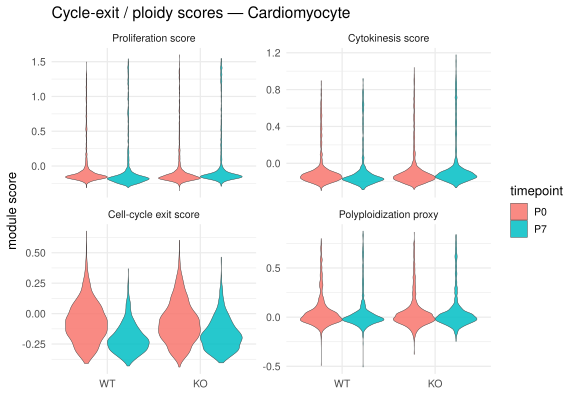
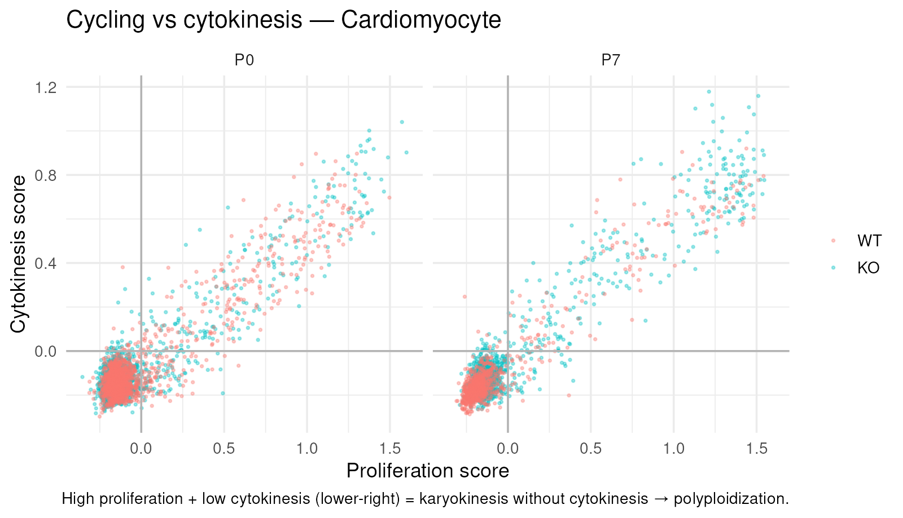
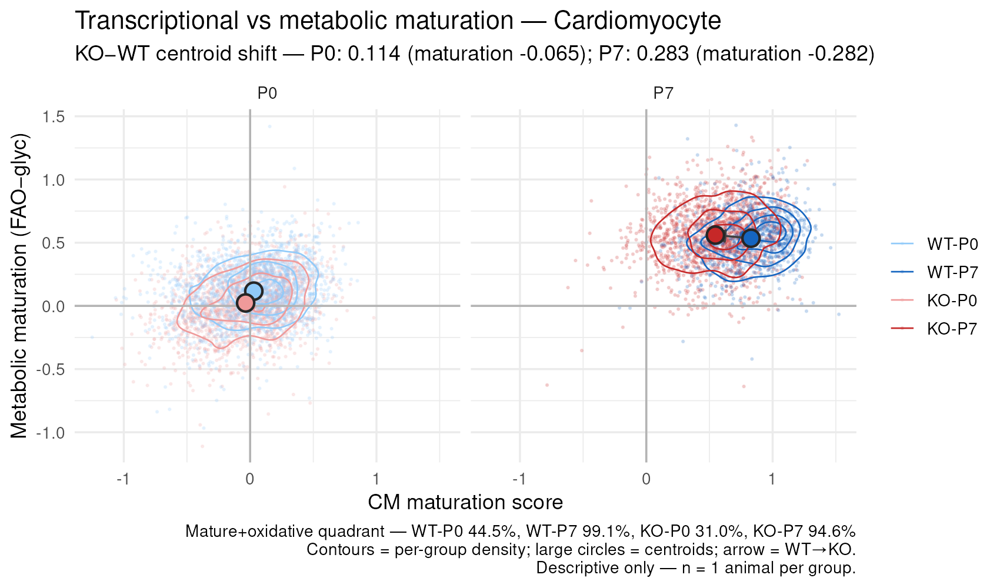
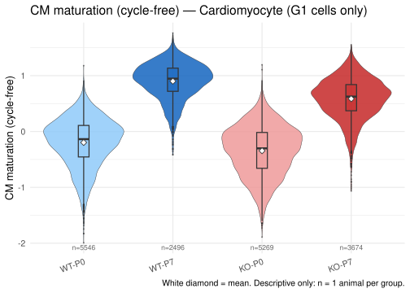
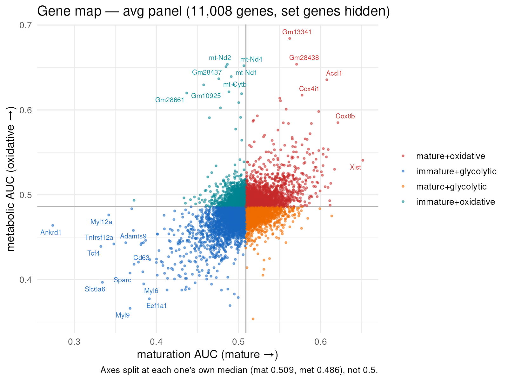

## What you're looking at

Two tabs under **Dev**. **Cell-cycle exit & ploidy** shows four module-score
distributions across genotype and timepoint, plus a proliferation-versus-cytokinesis
scatter. **Maturation & metabolism** shows a maturation score across the four groups, a
per-cell maturation-versus-metabolism plot, and a *Gene map* that places every gene on
two axes.

The same machinery underlies both, and it is also what the four-group maturation panels
in [chapter 7](07-fourgroup.qmd) and the intersections in
[chapter 9](09-overlaps.qmd) are built on.

## The question

Single genes are noisy in single-cell data — a cardiomyocyte can be genuinely
proliferative and have zero `Mki67` reads. Scoring a *program* (a curated set of genes)
per cell is more robust, and it makes composite questions expressible: "cycling without
cytokinesis" is a difference of two programs, not any single gene.

## How it was done

### The scoring function

An `AddModuleScore` equivalent, written in base R plus Matrix — no Seurat at build time:

```r
module_score <- function(mat, features, nbin = 24, ctrl = 100, seed = 1) {
  avg  <- Matrix::rowMeans(mat)                    # mean expression per gene
  bins <- cut(avg, breaks = quantile(avg, seq(0, 1, length.out = nbin + 1)), ...)
  for (f in features)                              # 100 control genes per feature,
    ctrl_genes <- c(ctrl_genes, sample(names(bins)[bins == bins[[f]]], ctrl))
  Matrix::colMeans(mat[features, ]) - Matrix::colMeans(mat[ctrl_genes, ])
}
```
<span class="src">shiny_app/build_signature_scores.R:102-120 — copied verbatim into build_refmap.R:49-66</span>

The control subtraction is the whole point: a set of highly expressed genes scores high
in every cell simply because its genes are abundant. Subtracting a set matched on
expression bin removes that baseline, so the score reflects *relative* enrichment of the
program in that cell. `nbin = 24`, `ctrl = 100`, `set.seed(1)`.

### The gene sets

Eight sets, four difference scores, all defined at
`build_signature_scores.R:48-78`. Sex/construct confounders are removed from every set
before scoring (none of these sets contains one, so the scores are confounder-free by
construction).

| Score | Definition |
|---|---|
| `sig_prolif` | 17 G2/M-programme genes: `Mki67`, `Top2a`, `Ccnb1/2`, `Cdk1`, `Cdc20`, `Aurka/b`, `Bub1`, `Birc5`, `Cenpa/e/f`, `Ube2c`, `Cks2`, `Nusap1`, `Tpx2` |
| `sig_cytokinesis` | 14 cytokinesis-machinery genes: `Anln`, `Ect2`, `Racgap1`, `Kif23`, `Cit`, `Aurkb`, `Kif20b`, `Prc1`, `Cep55`, `Mklp1`, `Sept7/9`, `Cdca8`, `Incenp` |
| `sig_ccexit` | 8 exit/arrest genes: `Cdkn1a`, `Cdkn1c`, `Cdkn2a`, `Cdkn1b`, `Meis1`, `Rb1`, `Btg2`, `Gadd45a` |
| `sig_ploidy` | **`prolif − cytokinesis`** — karyokinesis without cytokinesis |
| `sig_maturation` | **`mat_mature − mat_immature`** (10 vs 9 genes) |
| `sig_maturation_nocc` | **`mat_mature − mat_immature_nocc`** — the immature set minus `Ccnd1`, `Mki67`, `Top2a` |
| `sig_metabolic` | **`faox − glycolysis`** (14 vs 11 genes) |



Two things in that table are load-bearing. **Which matrix a score was computed on
decides how many cells have it**: the cycle and metabolic scores were computed on the
broad matrix and exist for **8,026 cells**, while the maturation scores were computed on
the curated panel and exist for all **30,030**. And `sig_cytokinesis` uses 13 of 14
genes — `Mklp1` is a synonym for `Kif23`, which is already in the set, so nothing is
actually lost.

`pick_mat()` chooses per set, by coverage, with ties going to the curated panel
(`build_signature_scores.R:122-125`). Both components of a difference score are always
scored on the **same** matrix, or the subtraction would not be well defined.

{#fig-cyc}

{#fig-ploidy}

{#fig-mat-scatter}

{#fig-mat-violin}

### The gene map

The same idea turned inside out: instead of scoring cells for a program, score **genes**
for how strongly they mark one end of a program.

Cells are split into tertiles on a score, and each gene gets the AUC of a Wilcoxon
comparison between the top and bottom tertile — computed **within each timepoint and
then averaged**, so neither axis becomes a restatement of P0-vs-P7 (which the sort
confounds). Two axes: `mat_auc` (mature vs immature) and `met_auc` (oxidative vs
glycolytic), plus a binary cycling axis (S/G2M vs G1).

{#fig-genemap}





## What it shows

**The two programs are coupled, and not because of their inputs.** With score-set genes
hidden, 28.8 % of genes sit in mature+oxidative and 28.3 % in immature+glycolytic — the
two diagonal quadrants total **57 %**, where 50 % would mean the axes are independent.
The coupling survives removing the genes that define the scores, which is the test that
matters.

## Why this way

**Why difference scores rather than reporting the components?** Because the biological
questions are differences. "Polyploidization" is not high proliferation — it is
karyokinesis *without* cytokinesis, which only a difference expresses; a cell high in
both is dividing normally. The components are stored too, and the app plots them, so the
difference can always be decomposed.

**Why `sig_maturation_nocc` exists.** `sig_maturation`'s immature program contains
`Ccnd1`, `Mki67` and `Top2a`. Using that score to argue "the KO leaves cells less mature
and therefore more cycling-competent" is then partly circular — the score is *already*
part cell-cycle score. `sig_maturation_nocc` drops those three, and every downstream
analysis that touches the cycling question defaults to it
(`build_fourgroup.R:MAT_SCORE`). The original is kept for continuity, not for
conclusions.

**Why the axes split at their own median, not at 0.5.** `wilcoxauc`'s AUC carries a small
global offset because the two tertile groups differ in overall detection rate — here
+0.009 on maturation and −0.014 on metabolism. Most genes sit within ~0.02 of the
median, so a hard 0.5 cut put **65 %** of them into a single corner: an artefact of the
offset, not biology. Each panel gets its own centre, because the offset is a property of
the cells being compared — the P0 panel centres at 0.498 and the P7 panel at 0.519, a
difference of 0.021 that a shared centre would smear across the map.
<span class="src">app.R:1868-1876</span>

**Why the axes use a looser row gate than the DE tables.** Expression level only, no
significance requirement. Applying the DE gate dropped `Gapdh`, `Aldoa`, `Pgk1`, `Eno1`,
`Hk1` and `Cpt1a` off the map entirely — core glycolysis and fatty-acid oxidation genes,
absent from a metabolic map. **A gene with no association belongs at the origin, not
missing**, and a reader who cannot find `Gapdh` reasonably concludes the map is broken.

**Why `in_score_set` genes are hidden by default.** A gene inside the set that defines an
axis sits at that axis's extreme by construction. `Cox6a2` is in both `mat_mature` and
`faox`, so it is doubly circular. Hiding them by default is what makes the 57 % coupling
figure meaningful; the flag stays on the table so they can be shown deliberately.

**Why AUC rather than log2FC for gene classification.** The same reason as
[chapter 3](03-de.qmd): on this data log2FC spans −1.86 to +0.43 across the maturation
axis, so a symmetric cut can only ever classify one pole. At AUC 0.60/0.40 the axis
yields roughly 135 mature- and 42 immature-associated genes.
<span class="src">build_fourgroup.R:81-87</span>

## What it cannot say

- **A module score is not a measurement of a process.** It is a relative enrichment of a
  curated gene list against an expression-matched background, on one animal per group.
- **The cycle and metabolic scores exist for 8,026 cells, not 30,030.** Comparing a
  cycle score panel's n against a maturation panel's n is comparing two subsets.
- **`Cox6a2` remains doubly circular** and `Aurkb` sits in both `prolif` and
  `cytokinesis`, so `sig_ploidy` has one gene cancelling itself. Both are flagged rather
  than removed, because removing a gene from a curated set silently changes what the set
  means.
- **Tertile AUCs are not effect sizes on a biological scale**; they rank genes within
  this dataset.

## Reproduce it

```bash
Rscript shiny_app/build_signature_scores.R --probe   # per-set coverage, writes nothing
Rscript shiny_app/build_signature_scores.R           # compute + save
Rscript shiny_app/build_fourgroup.R                  # the gene axes live in $geneaxes

docs/export.sh --only='cyc-|ploidy|mat-|genemap|score-coverage'
```

## Where these gene sets came from — the **Gene sets & sources** tab

Every score on this page is a mean over a gene list, so the lists are the method. Of the
**46 gene sets this project uses, 7 are fetched from an external database and 38 are
hand-curated** — typed into a script here with no citation, no version, and no record of
why a gene is in or out. Grepping the repository for a DOI, PMID or reference inside a
gene-set definition returns nothing.

The seven with real provenance are the ones pulled from a package at runtime rather than
typed: MSigDB Hallmark, KEGG_LEGACY and GTRD-TFT via `msigdbr`, GO BP via `org.Mm.eg.db`,
CellChatDB, and Seurat's `cc.genes.updated.2019`. Everything else — the cell-type markers,
E2F targets, maturation and metabolic panels behind the scores above — is ours.

That is not a correctness claim either way. The genes are standard cardiac and cell-cycle
markers; what is missing is any way to audit the **selection**. So the panels were
benchmarked against published counterparts where one exists:

| Panel | Reference | Ours covered |
|---|---|---|
| `prolif` | HALLMARK_G2M_CHECKPOINT | 16/17 (94 %) |
| `glycolysis` | KEGG_GLYCOLYSIS_GLUCONEOGENESIS | 10/11 (91 %) |
| `E2F_TARGETS` | HALLMARK_E2F_TARGETS | 20/29 (69 %) |
| `faox` | KEGG_FATTY_ACID_METABOLISM | 9/14 (64 %) |
| `ccexit` | HALLMARK_P53_PATHWAY | 5/8 (62 %) |
| **`mat_mature` / `mat_immature`** | **none exists** | **—** |

Most hold up once measured against the right reference, and the benchmark cuts both ways:
HALLMARK_GLYCOLYSIS covers only 6/11 of the same glycolysis panel because *it* omits
Gapdh, Hk1, Pfkm, Pfkl and Slc2a1. Hallmark sets are co-expression-derived rather than
membership-curated, so scoring a metabolic panel against Hallmark alone penalises it for
being more canonical, not less.

Three caveats change how a score on this page should be read.

- **The maturation panels have no published counterpart at all.** The maturation score
  rests on a list with no external anchor. [Uosaki et al. 2015](https://doi.org/10.1016/j.celrep.2015.10.032)
  is the atlas to reconcile them against; that has not been done.
- **`sig_maturation`'s immature side contains Ccnd1, Mki67 and Top2a**, so it is partly a
  cell-cycle score. Use `sig_maturation_nocc` for any argument involving cycling —
  otherwise "less mature, therefore more cycling-competent" is circular.
- **`faox` carries Cox6a2, Etfa, Ndufa4, Ppargc1a and Sdha**, which are OXPHOS rather than
  fatty-acid oxidation. The panel is a deliberate FAO/OXPHOS blend and should not be
  reported as pure FAO.

The tab also flags panels that share a name but not their genes. The app's *CM maturation*
dropdown holds 14 genes while the `sig_maturation` score it plots is computed from 19 —
the same label meaning two different things, reported rather than silently reconciled,
because choosing which list is correct is a biology call.
<span class="src">our_analysis/05_analyses/gene_set_provenance.R, gene_set_benchmark.R</span>
