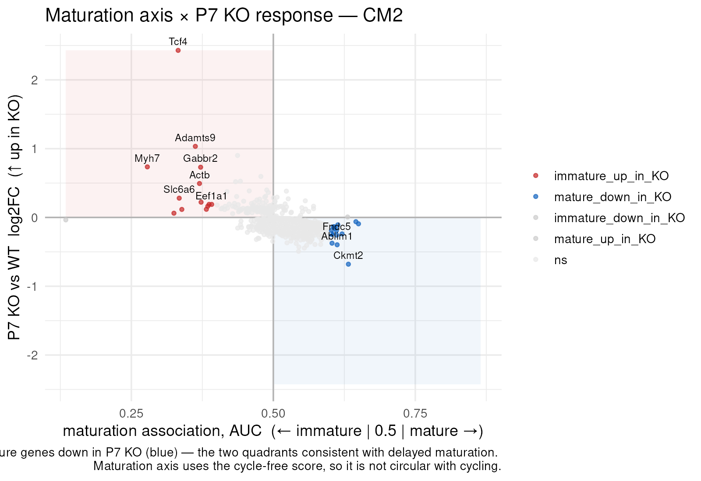
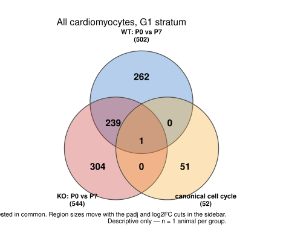
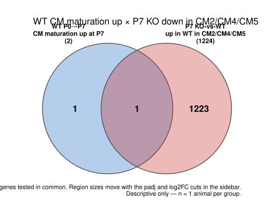

## What you're looking at

Three tabs that all do the same kind of thing: take two or three gene sets defined by
different analyses and ask whether their overlap means anything.

- **Maturation ∩ P7 KO** — the maturation axis crossed with the P7 KO response, as a
  quadrant map, an intersection table, and a candidate-gene view.
- **Gene-set Venn** — any two or three sets (DE contrasts, score axes, intersection
  quadrants, curated panels) with every pairwise overlap tested.
- **WT programs ∩ KO clusters** — one specific request, four ways: the WT P0→P7 change
  in a curated category crossed against the P7 KO response in a named group of
  subclusters.

## The question

"Are the genes the knockout moves at P7 the same genes that normally change as
cardiomyocytes mature?" That is the project's central hypothesis, and it is a
set-overlap question. Set overlaps are also where analyses go wrong most quietly,
because a Venn diagram displays a number without displaying any of the four decisions
that produced it: the threshold on each side, the direction, the universe, and the
expectation under chance.

## How it was done

### The quadrant map

Every gene gets a maturation-axis coordinate (`mat_auc`, from
[chapter 8](08-scores.qmd)) and a P7 KO-vs-WT log2 fold change, and falls into one of
four quadrants. Two of them are the hypothesis: `immature_up_in_KO` and
`mature_down_in_KO`.

{#fig-quadrant}



The x-axis is **AUC, not log2FC**, and the plot says so in its own comment
(`app.R:1241-1244`): immature markers here are far higher-dynamic-range genes than
mature ones, so a log2FC axis would push every classified gene to one side.

### The Venn

Each set id resolves to **both a gene list and its testable universe**
(`vn_set()`, `app.R:1468-1509`). The universe for a pair is the intersection of the two
sets' universes, and each set is restricted to it before anything is counted. Overlaps
are then tested with a hypergeometric against that universe.

{#fig-venn}



### The four crossings

The KO side is defined by **clusters, not by a gene category**: the maturation group is
CM1/CM2/CM3/CM7/CM8 and the cycling group is CM2/CM4/CM5 (CM2 is in both, and the tab
says so). Each WT category list is crossed against the **opposite** category's cluster
group. <span class="src">app.R:1613-1626</span>

{#fig-xc-venn}



And the audit that runs alongside it, always, not only on disagreement:



## What it shows

Read the audit table first, because it is the methodological result of this chapter.
Under **AUC ≥ 0.60** the WT P0→P7 comparison finds 3 canonical cell-cycle genes changing
(all "up at P7"); under a symmetric **|log2FC| ≥ 0.25** it finds **zero**. The same data,
the same contrast, two effect-size measures, and one of them supports the sentence "no
cell-cycle gene changes between WT P0 and P7" — which is false, and which someone would
carry away from this tab if it reported only one measure.

In the crossings, `matDN_cycUP` — maturation genes that fall from P0 to P7 in WT,
crossed against genes up in the P7 KO in the cycling clusters — gives an overlap of 2
genes where 0 were expected, a **45.5×** enrichment at p = 7.6 × 10⁻⁴. Two genes is two
genes; the enrichment is real against chance and the set is far too small to build a
story on. Both facts belong in the same sentence.

## Why this way

**Why the universe is the tested gene space, never the gated DE table.** The row gate on
`app$fourgroup$de` has already removed expressed-but-unchanging genes — precisely the
background a hypergeometric needs. Using the gated table as the universe inflates every
fold enrichment, because the denominator has been pre-selected for the same signal as
the numerator. `xc_universe()` (`app.R:1632`) takes the full tested space instead, minus
confounders, and the comment above it puts it bluntly: "a hypergeometric against a
14-gene universe is not a null, it is a tautology."

**Why the overlap statistics tab exists at all.** Set sizes here are lopsided by design
— a curated category of a dozen genes against a cluster-group union of hundreds — so the
*picture* is uninformative: a tiny circle inside a big one looks like containment
whatever the numbers. The fold enrichment and the hypergeometric p, not the diagram, are
what carry the result. The app puts them on their own sub-tab rather than in a caption.

**Why the cycling circle defaults to the curated canonical set.** The data-driven cycling
axis calls **531** genes cycling-associated, of which only **46** are canonical. The rest
are largely housekeeping — `Ran`, `Nap1l1`, `Calm1`, `Ppia` — because cycling cells are
globally more transcriptionally active, so a cycling axis partly measures library
complexity. Crossing anything against those 531 genes produces significant overlaps that
mean "these genes are expressed in busy cells".

**Why the KO side is clusters and not a category.** Filtering both sides by gene category
would make two of the four crossings intersect the maturation set with the cell-cycle
set, and those two curated sets share only `Mki67` and `Top2a`. The Venns would read
empty *by construction* rather than by biology — the worst kind of negative result,
because it looks like an answer.

**Why the one-directional warning fires.** At AUC ≥ 0.60, CM1 has roughly 1,700 genes
down in the KO and 50 up. Seven independently clustered populations do not agree that
hard by biology; it is the same one-directional signature the collaborator deliverable
traced to a library read-fraction difference. The tab flags it whenever the median
up/down ratio exceeds 5×, and hides `mt-` genes by default for the same reason.

**Why dropped clusters are named.** Choosing the phase-matched stratum removes CM4
entirely (no G1 cells anywhere). Quietly computing a two-cluster answer under a
three-cluster label is how a result becomes wrong without anyone editing a number, so
the tab names what fell out.

## What it cannot say

- **An overlap of two genes is not a program**, however enriched it is against chance.
- **The two KO cluster unions are not independent** — CM2 is in both.
- **Nothing here is causal.** The intersection describes genes that are both
  maturation-associated and KO-responsive; the KO is not transcript-confirmed
  ([chapter 6](06-e2f.qmd)) and the animals differ in sex.
- **Hypergeometric p-values inherit the DE tables' pseudoreplication** through the
  thresholds that built the sets.
- **The quadrant assignment is threshold-dependent.** Genes near a centre swap quadrants
  under a small change of cut; `distance` from the centre is on the table so a reader can
  ignore the marginal ones.

## Reproduce it

```bash
Rscript shiny_app/build_signature_scores.R    # the axes the intersections use
Rscript shiny_app/build_fourgroup.R           # $geneaxes + $intersect
Rscript shiny_app/build_fourgroup.R --de2     # the curated grid the Venn can switch to

docs/export.sh --only='quadrant|venn|xc-|tbl-intersect'
```
