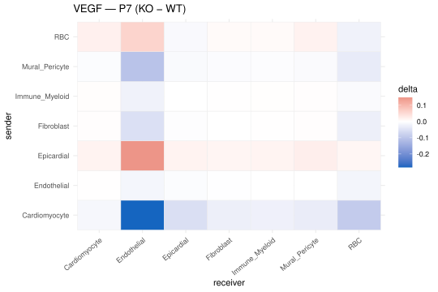

## What you're looking at

**Whole heart → Cell–cell signalling**: a sender × receiver heatmap of curated ligand→receptor
scores, viewable as WT, KO, or their difference, plus the interaction table behind it.

{#fig-commun}

## The question

Cardiomyocyte maturation is not autonomous — it is paced by the coronary vasculature,
and the angiogenic signalling between endothelium, cardiomyocytes and mural cells is a
plausible route by which a cell-cycle perturbation could change maturation timing. The
question here is narrow: **do the curated angiogenic ligand–receptor pairs look
different between KO and WT?**

## How it was done

Twenty curated pairs across ten pathways — VEGF (6 pairs), Angiopoietin (2), Notch (3),
PDGF (2), Apelin, Ephrin, BMP, Neuregulin (2), IGF, Natriuretic.
<span class="src">shiny_app/build_communication.R:30-51</span>



For each pair and each `celltype | genotype | timepoint` cell, the score is

$$
\text{score} = \overline{\text{ligand}}_{\text{sender}} \times \overline{\text{receptor}}_{\text{receiver}}
$$

on log-normalised expression, with `delta = KO − WT`. That is a NATMI/connectome-style
product score — the arithmetic is deliberately as simple as it looks.



## Why this way

**Why a curated pair list rather than CellChat or LIANA?** Those tools bring a curated
database of thousands of interactions *and* a permutation test that asks whether a
score is higher than expected when cell labels are shuffled. The permutation test is the
valuable part, and it is exactly the part this design cannot support: with one animal
per condition, shuffling cell labels tests whether cell *types* differ, which is not in
question, and gives a p-value that reads as evidence about the genotype. Running
CellChat here would produce a figure with significance stars that mean something other
than what a reader would take them to mean.

So the app does the honest minimum: a transparent product score over a pair list small
enough to print in full, with **no p-value anywhere**, labelled in the tab as
descriptive. A reader who wants to know why VEGF appears can read the six pairs behind
it in the table above.

**Why mean × mean rather than a fraction-expressing term?** A product of means is
monotone in both inputs and needs no extra threshold. Adding a "expressed in ≥ X % of
cells" gate would introduce exactly the kind of hidden parameter this tab is trying to
avoid, and with these cell numbers the choice of X would move the ranking.

**Why show KO − WT rather than KO and WT separately by default?** Because the absolute
scores are dominated by how abundant the ligand is, which is the same in both genotypes;
the difference is the only part relevant to the question. Both single-genotype views are
available for checking that a large difference is not a difference of two near-zero
numbers.

## What it cannot say

- **No significance, by design.** A large delta here is a candidate to look at, nothing
  more.
- **A product of population means is not communication.** It cannot distinguish "many
  cells signalling weakly" from "few cells signalling strongly", ignores spatial
  proximity entirely, and treats ligand mRNA as a proxy for available protein.
- **Only 20 pairs were looked at.** This is a targeted check of an angiogenic
  hypothesis, not a screen. Absence of a pathway from the heatmap means nobody scored
  it.
- **Cell-type abundance differs between the groups** ([chapter 2](02-atlas.qmd)), so a
  mean over a compartment is a mean over a differently composed compartment.

## Reproduce it

```bash
Rscript shiny_app/build_communication.R      # writes app$commun
docs/export.sh --only='commun'
```
