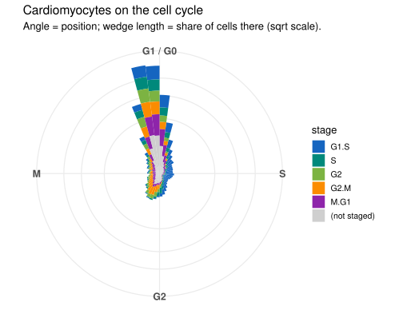
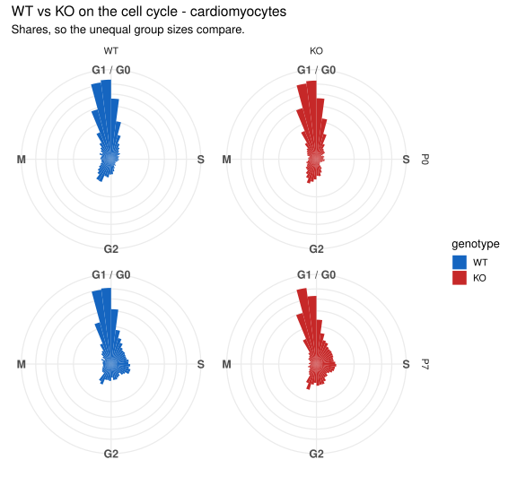
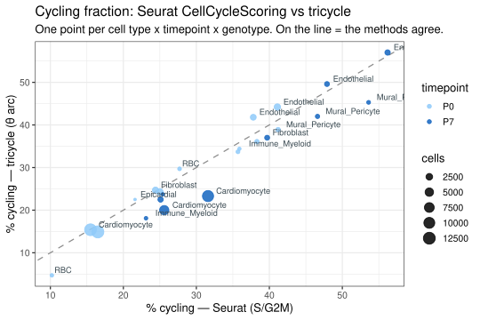
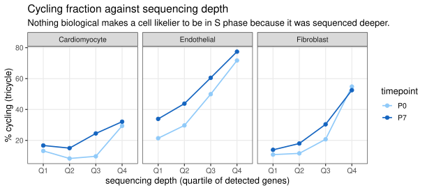
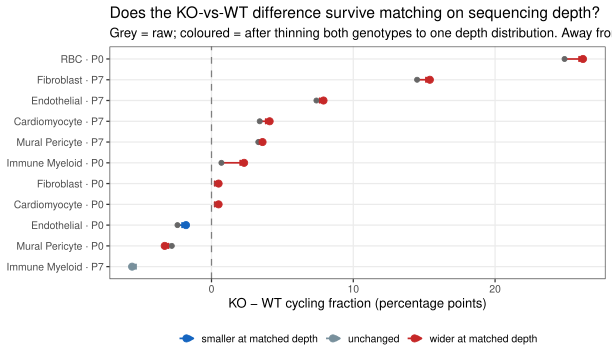
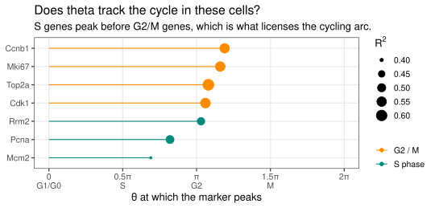

## What you're looking at

**Cell cycle → Cell cycle (tricycle)**. Five panels built on one idea: the cell cycle is a
*cycle*, so a cell's state is a **position on a circle** rather than one of three labels.

Every other cell-cycle number in this app comes from Seurat's `CellCycleScoring`, which
scores each cell for S and G2/M markers and takes an argmax. That call has two structural
limits. It cannot place a cell *between* phases, and it cannot decline to answer — every
cell gets one of `G1`, `S`, `G2M` no matter how thin the evidence. tricycle
([Zheng et al. 2022](https://doi.org/10.1186/s13059-021-02581-y)) projects each cell onto a
**fixed reference cycle** learned from mouse neurosphere data and returns a continuous angle
θ, plus a discrete stage call that is *allowed to abstain*.

The **wheel** is the panel your eye should go to first. It is not θ re-plotted on a circle of
fixed radius — it is tricycle's own two-dimensional cycle space, and the **distance from the
centre carries meaning**: it is how much cell-cycle signal the cell has at all. A cycling
population forms a ring with a hollow middle. A population that has left the cycle forms a
blob. No threshold has to be chosen for that difference to be visible, which is the whole
argument for looking at it this way.

## Two pictures of the same angle

The tab draws θ twice, because neither view alone does the job.

**The cycle diagram** is the clock face: G1/G0 at twelve, running clockwise through S, G2 and
M, with each wedge as long as the *share* of cells sitting at that position. It is the view
that needs no explanation, and it is the one to split by genotype — set the colouring to
*Genotype* and the four panels are WT and KO at P0 and P7 on the same cycle.

**The wheel** is the measurement in its own coordinates, and it carries something the clock
face cannot express: **radius**. A cell near the centre is not at some phase, it has barely
any cell-cycle signal at all. That is why the wheel is the honest one — a cycling population
opens into a crescent, a population that has exited stays balled up at G1/G0, and no
threshold had to be chosen for the difference to be visible.

{#fig-cc-rose}

{#fig-cc-wheel}

Two display choices are worth knowing, because both are transforms and neither is hidden:

- **Wedge length is a share, not a count.** The four groups differ in size by nearly 2×
  (P7 KO 10,597 cells against P7 WT 6,537). On raw counts the knockout's wedges would be
  longer before any biology entered — in the one figure built to compare them.
- **Both radial axes are square-root scaled.** About 70 % of cardiomyocytes sit in the
  G1/G0 pile, and on a linear axis that single spike *is* the figure; every other phase
  renders as a stub too short to carry a colour. The square root keeps G1/G0 visibly
  dominant, which is the true headline, while making the rest of the cycle readable. Angles
  are never transformed, and the wheel has a toggle back to the raw radius.

{#fig-cc-geno}

## The question

Cardiomyocytes in this dataset score 15–17 % "cycling" at P0 and 26–32 % at P7. The rise is
the wrong direction for the textbook story — mouse cardiomyocytes are exiting the cycle over
that window — so the obvious suspicion was that `CellCycleScoring` was manufacturing cycling
cells, because `AddModuleScore` centres every cell against control gene sets drawn from *the
same dataset*, and in a barely-cycling population that can turn noise into a phase call.

This analysis was written to test that suspicion with a method that shares none of the
machinery.

## What it found — the opposite of the hypothesis

**The suspicion did not survive.** tricycle agrees with `CellCycleScoring`: Cohen's κ = 0.867,
95.1 % per-cell concordance, and r = 0.966 across cell-type × timepoint × genotype groups,
with 497 of tricycle's 500 reference genes matched. The phase calls used elsewhere in this
app are **not** a Seurat artifact, and the P0 → P7 rise reproduces under an independent
method.

{#fig-cc-vs}

Two things follow, and the second matters more than the first.

1. **The direction is real as a measurement.** It is also not prima facie absurd as biology:
   mouse cardiomyocytes go through a binucleation wave around P4–P10, entering S phase and
   mitosis without completing cytokinesis. Elevated S/G2M signal at P7 is consistent with
   that, so "P7 > P0" cannot by itself be called an error.
2. **Both methods are strongly depth-dependent.** Within one cell type at one timepoint the
   cycling fraction climbs monotonically with detected genes. Nothing biological makes a cell
   likelier to be in S phase because it was sequenced more deeply, so that slope is
   measurement. Matching P0 and P7 cardiomyocytes on depth turns 15.1 % → 22.1 % into
   18.5 % → 20.7 %, removing about two thirds of the gap.

{#fig-cc-depth}

On top of that sits an **ambient-RNA floor**. 99.5 % of non-cardiomyocytes in this dataset
detect cardiac sarcomere transcripts (*Tnnt2*/*Myh6*/*Actc1*) that they cannot possibly
transcribe. The same ambient pool carries proliferation transcripts into every barcode, and
the "RBC" population scores 18.4 % cycling by tricycle against cardiomyocytes' 17.9 % — at or
above the number the whole question is about.

### Depth is hiding the knockout effect, not creating it

The natural worry is that (2) manufactures (1). It does not — it runs the other way, which is
worth stating plainly because the intuition is so strongly the reverse.

At P7 the **wild type is the deeper library**: median 20,022 UMIs against the knockout's
12,412, a depth AUC of 0.29. Deeper sequencing inflates the cycling call. So the raw
comparison is flattering the genotype with the *lower* number, and the raw gap is a
conservative estimate rather than an inflated one.

`cellcycle_tricycle_depthmatched.R` measures this rather than arguing it. Within each cell
type × timepoint, every cell is binomially downsampled toward the pointwise minimum of the
two genotypes' depth distributions — the same quantile-floor thinning `ko_signature_ml.R`
uses, so the two analyses cannot disagree about what "depth-matched" means — the thinned
counts are re-normalised, and **tricycle is asked again from scratch**. Re-labelling cells
inside depth bins would not do: the cycling call is itself computed from depth-sensitive
counts, so a cell carries its inflated label into its bin.

{#fig-cc-matched}

Matching drives the depth AUC to 0.500 in every stratum, so genotype can no longer be told
from depth at all. The gaps then move slightly *away* from zero almost everywhere:



P7 cardiomyocytes go from **+3.4 to +4.1** points. The effect is small — the honest headline
is "the difference survives depth matching and is marginally larger", not "depth was masking
a big effect". P7 fibroblasts carry a much larger gap than cardiomyocytes do (+14.5 → +15.4),
which is worth a look in its own right.

Depth matching removes depth. It cannot remove sex, animal or library, and n = 1 per group.

> **The honest reading.** It is not "Seurat was wrong and tricycle is right". It is that the
> *absolute* cardiomyocyte cycling fraction is not resolvable above the ambient/depth floor in
> this dataset, and neither method can fix that, because the problem is upstream of both.
> Comparisons made **at matched depth**, and **KO vs WT within a single timepoint**, are the
> reads that survive.

This is also the validation that [chapter 7](07-fourgroup.qmd) needs. The four-group panels
stratify on `G1` to avoid comparing a cycling-enriched sample against an unenriched one, and
that chapter flags that phase calls are themselves model output. They are — but they are
reproducible model output, and this is where that was checked.

## How it was done

`our_analysis/05_analyses/cellcycle_tricycle.R`, in the `e2f-tricycle` image
(`our_analysis/Dockerfile.tricycle`, built on `e2f-seurat-full`):

1. Read `processing/seurat.combined.annotated.rds` — the **whole heart**, deliberately, not
   just cardiomyocytes. Genuinely proliferative populations act as a positive control: a
   method that reports nothing cycling anywhere would "agree" with the expected biology by
   accident, and only if it separates cycling immune and fibroblast cells from P7
   cardiomyocytes is the cardiomyocyte result interpretable at all.
2. `project_cycle_space()` on log-normalised counts — the same matrix Seurat scored, so no
   normalisation difference can explain a disagreement — then `estimate_cycle_position()` for
   θ and `estimate_Schwabe_stage()` for the discrete, abstention-permitting stage.
3. The cycling arc is **derived, not assumed**: `fit_periodic_loess` of each canonical marker
   against θ puts the S genes first and the G2/M genes after (*Mcm2* 0.69π, *Pcna* 0.82π,
   *Rrm2* 1.03π, *Cdk1* 1.06π, *Top2a* 1.08π, *Mki67* 1.16π, *Ccnb1* 1.19π; R² 0.40–0.62).
   That places S-through-M in (0.5π, 1.5π), which is the arc counted as cycling.
4. Three controls — marker ordering, sequencing depth, ambient RNA — written to
   `cellcycle_tricycle_controls.csv` so the app quotes the run rather than a remembered number.

{#fig-cc-peaks}

Both methods' cycling fractions, for every group:



And the controls the caveats above are read from:



`shiny_app/build_tricycle.R` then carries the per-cell table into `app_data.rds` as
`app$tricycle`, and joins θ, stage and the cycling flag onto `app$meta` so the **UMAP
explorer** can colour by tricycle stage as well.

## What it cannot say

- **Nothing here is a hypothesis test.** n = 1 animal per genotype × timepoint, and genotype
  is confounded with sex. KO-vs-WT differences are descriptive.
- **Cycling is not division, and it is certainly not binucleation.** A cell on the arc is
  expressing cell-cycle transcripts. Whether it completes cytokinesis is exactly the question
  this assay cannot reach — see the cycle-exit and ploidy scores in
  [chapter 8](08-scores.qmd), which are proxies rather than measurements.
- **Absolute fractions are floored** by ambient RNA and inflated by sequencing depth, as
  above. The *Depth & ambient floor* panel exists so this is visible from inside the app
  rather than only in the methods.
- **53.9 % of cells are not staged.** That is the Schwabe call declining to guess. Those cells
  are shown as their own grey category and are never renormalised away; a method that can say
  "I can't tell" loses the point of doing so if the app hides it.

## Reproduce it

```bash
# the analysis (needs the 3 GB annotated object; ~20 min)
docker run --rm -v "$PWD":/work -w /work/our_analysis e2f-tricycle:latest \
  Rscript 05_analyses/cellcycle_tricycle.R
# smoke test on a subsample instead
#   Rscript 05_analyses/cellcycle_tricycle.R --max-cells=4000

# carry it into the app bundle
Rscript shiny_app/build_tricycle.R
```

Outputs: `results/tables/cellcycle_tricycle_{percell,vs_seurat_by_celltype,confusion,
marker_peaks,depthmatched_cm,controls}.csv` and two figures under `results/figures/`.
The run is deterministic (`SEED <- 42L`); the console log is kept at
`our_analysis/logs/log_cellcycle_tricycle.txt`.
