# Cardiomyocyte cell-cycle fate model — results so far

What we did with the two Bergmann-lab FUCCI papers, what came out of it, and what
is still open. Every number here is produced by code in this directory
(`python3 -m cmcycle.baniol`, `python3 -m cmcycle.preflight`), so the write-up
cannot drift from the data.

**Papers.**

- **Baniol et al. 2021**, *Exp Cell Res* 408:112880 — FUCCI transgenic mouse
  (mKO2-hCdt1 / mAG-hGeminin), in-vivo phase-state fractions at P0/P7/P15/adult
  plus 285-cell Smart-seq2 scRNA-seq (ENA PRJEB47622).
- **Murganti et al. 2022**, *Front Cardiovasc Med* 9:840147 — TNNT2-FUCCI human
  iPSC-cardiomyocytes, 72 h live-imaging fate outcomes and durations, plus a
  94-compound screen and the clonidine follow-up in three systems.

**Status.** The analysis and pre-flight validation are done. The **Tier-1 logic
network (`cmfate`) is built, calibrated and running** — 55 nodes, 78 reactions,
stdlib-only, 51 tests. It reproduces the fit context exactly and gets 3 of 3
held-out clonidine outcomes, while over-predicting the magnitude of the entry
response at high maturation. The Tier-2 mechanistic ODE is specified but not
built. See [TODO.md](TODO.md).

---

## 1. Why a model, and why these two papers together

They are complementary rather than redundant. Baniol gives **in-vivo phase-state
fractions and transcriptional topology** in mouse; Murganti gives **single-cell
fate outcomes with absolute durations** in human iPSC-CM plus one drug tested in
three contexts. Neither alone constrains a fate model; together they do.

The biology to be modelled is a four-way outcome, and the crucial point is that
**two of the four failure modes are mechanistically distinct and must not share a
branch**:

| outcome | what happens | signature |
|---|---|---|
| quiescence | never enters S | — |
| division | mitosis + cytokinesis | AurKB⁺ midbody, cell number rises |
| **binucleation** | mitosis completes, **furrow fails** | nuclei per cell rises, ploidy flat |
| **polyploidization** | **G2 arrest**, APC/C never fires, no envelope breakdown | ploidy rises, nuclei flat |

Murganti's polyploid cells show mCherry-Cdt1 rising *before* mVenus-geminin is
lost, with slow decay and no sharp drop — the fingerprint of G2 arrest rather than
a failed furrow.

### The clonidine triad — the single most valuable test case

One drug, ~2.2× cell-cycle entry in every context, **three different outcomes**:

| context | entry | outcome markers | fate |
|---|---|---|---|
| hiPSC-CM (least mature) | Ki-67 9.0 → 22.0% | AurKB⁺ midbodies 0.83 → 1.69%; ploidy and binucleation flat | **division** |
| mouse neonatal CM, in vitro | Ki-67 10.97 → 23.23% | tetraploid 26.52 → 38.93%; **zero** midbodies in >10,000 cells | **polyploidization** |
| neonatal mouse, in vivo | EdU 25.54 → 36.15% | mononucleated 22.3 → 14.8%; ploidy flat | **binucleation** |

A model that reproduces all three by changing only a maturation coordinate (plus
an in-vitro/in-vivo flag) has earned some trust. Note also the free negative
control: endothelial cells were unaffected (p=0.85) while smooth muscle responded
(p=0.04), so no model may predict a generic mitogenic effect.

---

## 2. Pre-flight: check the papers against each other before modelling anything

Four closed-form functionals of the same cycle constrain each other:

```
instantaneous phase fraction  ≈  entry rate × phase duration
instantaneous Ki-67 index     ≈  entry rate × Ki-67 dwell     (LINEAR in rate)
cumulative EdU index          =  1 − exp(−rate × window)      (SUBLINEAR in rate)
fate-budget identity          :  ΔEdU ≈ ΔBinuc + ΔPoly + 2·ΔDiv
```

`python3 -m cmcycle.preflight` runs six such checks. Two flag real tensions.


**The hiPSC data contains a hidden arrested pool.** Live imaging scored an outcome
in 9.65% of 570 cells over 72 h → entry rate 1.34×10⁻³/h. With the measured
16.38 h S/G2/M that predicts **2.20% mVenus⁺** at any instant; flow cytometry of
50,000 cells observed **5.10%**. Working backwards, the flow fraction implies an
apparent S/G2/M of **38.1 h**. The 2.9 pp excess is **2.1× larger** than the 1.40%
caught completing polyploidization, so the reported 24.5 h is a **right-censored
lower bound** and the model needs a persistent arrested state — a simple three-way
branch at one decision point cannot generate a reservoir. (Rule out a permissive
flow gate first.)

**The mouse arm is self-consistent across the two papers with nothing fitted.**
Baniol's P0/P7 mAG⁺ fractions (12.36% → 0.83%) with the 15.1 h duration give
S-entry rates of 19.7%/day and 1.32%/day — a 14.9× fall, exponential decay
k = 0.386/day. Integrated over the P1→P5 labelling window that predicts **32.8%
cumulative EdU** against Murganti's observed **25.54%**. Different papers, cohorts
and assay modalities agreeing to 1.28× is what licenses cumulative EdU as a
held-out validation target.

**Clonidine's two readouts are inconsistent with any pure entry-rate effect — and
the sign is diagnostic.** Ki-67 rose 2.12× but cumulative EdU rose 2.78×, ratio
**1.31**. Because EdU saturates, a rate increase *always* gives fold(EdU) <
fold(Ki-67) — verified numerically: rate folds of 1.5/2.0/3.0 give EdU folds of
1.46/1.90/2.72. The observation has the opposite ordering, so it cannot be a rate
change, and it cannot be a shorter cycle either. What survives: **Ki-67 decays in
arrested cells while the EdU label persists**, which makes the 1.31 positive
evidence *for* non-productive cycling. Prediction with a number attached: this
ratio should be ≈1.0 where cycling is productive and >1 where it is not.
(Saturation-corrected, the true in-vivo entry-rate fold is **1.52**, not 1.42.)

**Two more results.** The fate-budget identity holds on the mouse arm — 0.075
extra binucleation events per cell predicts 8.1 pp ΔEdU against 10.61 observed
(z = +0.77), so binucleation accounts for **76%** of the EdU rise. And the
cytoplasmic-FUCCI fraction (1% of P0 nuclei) with an independent 5.7%/day event
rate implies **cardiomyocyte mitosis lasts ≈4.2 h**, several-fold longer than the
~1 h of cycling somatic cells — a falsifiable number neither paper computed.

---

## 3. Re-analysis of the 285-cell dataset

### 3.1 Read the caveats first

**The sort is asymmetric, so cycling fractions here are an artefact.**


P0 is essentially unenriched (32.4% observed vs 32.5% expected in vivo), but P7 is
**4.5–5.2× enriched** (45.0% vs 8.7–10.0%). The raw cycling fraction therefore
*rises* from P0 to P7 in this dataset and *falls* in reality. Only within-group
expression contrasts are valid; phase and cycling fractions must come from
Baniol's imaging.

**Several genes of interest helped define the labels.** The Regev/Tirosh lists
behind `scanpy.tl.score_genes_cell_cycle` contain **Ect2** (G2/M) and **E2f8** (S),
among 21 panel genes. Three consequences:

1. Cycling-versus-noncycling contrasts are partly self-fulfilling for those genes,
   and `cycling_score` is a deterministic function of `phase`, so it adds nothing.
2. The P0→P7 within-cycling axis — where our findings live — is not circular in
   the same way, and the residual bias runs **against** the Ect2 result: selecting
   cells *called* G2M enriches for high Ect2 in both groups, compressing the
   difference. The clean comparators (RhoA, Racgap1, Cep55, Ccnb1, Ccna2) are all
   outside the lists.
3. **E2f8 is in the S-phase list**, which looked like a threat to the KO analysis; quantified in §8, it moves the KO−WT cycling gap by ≤0.5 pp.

The `Baniol2021_FUCCI_R` variant is *not* an independent phase call: `phase`,
`cycling_score`, `CellType`, `stage` and `cluster_label` are **100% identical**
across all 285 cells; only `seurat_clusters` differs (19.3%).

### 3.2 Ect2 is the specific maturational lesion


In cycling ventricular cardiomyocytes, P0→P7, **Ect2 falls to 0.55×** (Welch
t = −6.17, p < 10⁻⁴, clears Bonferroni over 25 genes). What makes this a *specific*
finding rather than just a significant one is the genome-wide baseline: the median
P7/P0 ratio across 417 expressed genes is **0.887** (P7 cells have slightly lower
complexity), and Ect2 sits at the **3rd percentile**. Nothing else in either
programme comes close — Cit 0.74×, Ccnb1 0.79×, Anln 0.91×, Racgap1 0.90×,
Cdk1 0.94×, Aurkb 1.11×, all inside normal drift.

**RhoA is the instructive near-miss.** It clears Bonferroni (p = 0.0004) yet sits
at the **29th percentile** genome-wide, so its low p-value comes from low variance
rather than a large effect. Significance is not specificity; we do not claim RhoA.

### 3.3 Module scores cannot see it


Averaged over 12 cytokinesis versus 13 mitotic genes, the two modules decline in
lockstep (0.871× and 0.903×) and their difference is flat: **Δ = +0.005, p = 0.93**.
The `sig_ploidy = sig_prolif − sig_cytokinesis` heuristic in
[build_signature_scores.R](../shiny_app/build_signature_scores.R) is a difference
of exactly these two averages, so on this data it is **structurally blind** to the
clearest cytokinesis-competence signal available. This is the concrete argument
for a model with named nodes.

### 3.4 The maturation coordinate is measurable, not a fitted knob


Define **M = mean z(fatty-acid oxidation) − mean z(glycolysis)** per cell, over 12
genes each. Three things make it a good coordinate:

**It is continuous, not a relabelled timepoint.** Between-stage separation is 1.78
against a within-stage SD of ~0.5, so single cells can be ordered along it.

**It reproduces a Baniol claim it was not built to test.** The ordering
P0-aCM < P0-vCM < P7-aCM < P7-vCM places **P7 atrial CMs (−0.07) between P0
ventricular (−0.68) and P7 ventricular (+1.12)** — exactly the paper's observation
that cycling P7 atrial cells are transcriptionally more immature and retain more
proliferative capacity.

**It predicts the model's two load-bearing couplings**, within cycling ventricular
cells alone (n = 89, P0 and P7 pooled so stage cannot be doing the work):


| node | role | r with M | t |
|---|---|---|---|
| Ect2 | cytokinesis competence | **−0.563** | −6.35 |
| E2f6 | cell-cycle exit enforcer | **+0.396** | +4.02 |
| Ccne2 | G1/S stall | +0.222 | +2.13 |
| E2f2 | endoreplication driver | +0.215 | +2.05 |
| Ccng1 | G2/M arrest | +0.190 | +1.80 (marginal) |

So Ect2(M) and E2f6(M) are **measured functions**, which removes the model's
largest degree of freedom. Caveats: n = 89; Ccng1 is marginal; the P0-atrial groups
are n = 8 and n = 4 and carry no claim; M is z-scored within this dataset and has
no absolute cross-system scale.

### 3.5 The E2F family splits into three roles



This independently reproduces and quantifies every E2F claim in the paper.
**E2f1/7/8** are cycling-restricted. **E2f2** is near-absent unless cycling and
rises with maturation (t = +2.18) — the endoreplication candidate. **E2f6** is the
only member expressed in noncycling cells, rising to 0.38 in **100%** of noncycling
P7 ventricular cells (t = +4.12) — the exit enforcer. And **E2f7 is flat across
maturation (t = −0.20) while E2f8 rises (t = +2.28)**, so they must be separate
model nodes.

Edges tested before wiring them (Spearman, n = 89): E2f1~E2f7 **+0.49**,
E2f1~E2f8 **+0.46** — supporting the E2F1 → E2F7/8 delayed-feedback arm as a real
edge, and it is precisely the arm the lab's KO removes. E2f1~E2f6 is **+0.18
(n.s.)**, so E2f6 is *not* part of the activator programme and belongs on its own
maturation-driven branch. E2f8~Ccna2 is **−0.56**, independently confirming E2F8
is G1/S-restricted and off in S/G2.

**One negative result that matters.** Gmnn~Cdt1 mRNA correlates *positively*
(+0.29) even though the FUCCI reporters they inspire are anti-correlated by phase,
because the oscillation is post-translational. So **scRNA-seq cannot validate the
FUCCI reporter module at all** — it must be checked against imaging traces only.

---

## 4. Five gene anchors the data overturns

Checked detection rates before wiring anything. Five obvious choices are wrong:

| node | obvious | detection | **use instead** | detection | why |
|---|---|---|---|---|---|
| mitotic brake | `Wee1` | 96/98% but **t = −1.32 (falls)** | **`Pkmyt1`** | 73→92%, **t = +2.81** | only Myt1 rises with maturation |
| p38 | `Mapk14` (p38α) | 81→73%, t = −1.28 | **`Mapk12`** (p38γ) | 12→44%, **t = +4.49** | Baniol's "p38 up at P7" is p38γ |
| APC/C co-activator | `Cdh1` | **4→0%** | **`Fzr1`** | 100/100% | `Cdh1` is *E-cadherin*; wiring mitotic exit to it hits an absent adhesion gene |
| Cyclin D | `Ccnd1` | **0→6%** | **`Ccnd2`** | 100/98% | Ccnd1 undetectable here |
| α1-adrenergic | `Adra1a` | **0→2%** | **`Adra1b`** | 46→79% | Murganti cited α1B and were right |

**A mechanism the papers did not state.** Across all 285 cells, P0→P7: `Nisch`
(imidazoline-I1/nischarin, clonidine's proposed pro-proliferative target) **falls**
1.277 → 1.047 at 100% detection, while `Adra1b` (0.051 → 0.097) and `Adrb1`
(0.094 → 0.156) both **rise**. Since β-adrenergic/PKA signalling *blocks*
cardiomyocyte cytokinesis (Liu 2019, *Sci Transl Med*), **the adrenergic balance
tips toward the cytokinesis brake exactly as cardiomyocytes lose the ability to
divide** — an independent reason why clonidine's effect should become less
productive with maturation. Limitation: `Adra2a/2b/2c` are absent from the store,
so clonidine's canonical α2 target cannot be assessed here at all.

**And one claim that weakens.** Baniol attributed the P7 G1/S delay to a
DNA-damage response, but on the P0→P7 within-cycling axis all four genes are flat
(Chek1 t = +0.41, Timeless +0.64, Ung −0.14, Msh6 −0.91). Their claim concerned one
G1/S sub-cluster rather than cycling P7 vCM as a whole, so this is not a
contradiction — but the **DDR module is hypothesis-only**, resting on Puente 2014
rather than on this dataset.

---
## 5. What this means for the lab's own E2f7/E2f8 KO data

The bundle has since been extracted and both questions are answered with data —
see **§8**, which supersedes what a first pass predicted here. In short: the E2f8
phase-scoring confound turned out to be real in principle and negligible in
practice, and the knockout is functionally confirmed even though E2f7/E2f8 mRNA is
*higher* in KO than WT.

The prediction that still stands, and is now testable: E2f7 is flat across
maturation while E2f8 rises, and both are E2F1-correlated, so the knockout
de-represses E2F at both ages. Any timepoint-dependent *phenotype* must therefore
come from downstream context — from Ect2 and M, not from the E2F layer. The model
now puts a number on it (§7.5).

---

## 6. Model architecture, as designed

Two tiers over one shared node vocabulary, answering different questions. Tier 1 is
built (§7 onward); Tier 2 is specified.

**Tier 2 — `cmcycle`, a mechanistic ODE extending Gérard & Goldbeter 2009.** That
model (BioModels `BIOMD0000000730`, 45 species, 108 reactions, 187 published
parameters, structurally flat) already supplies the Rb–E2F switch, all four
cyclin-CDK waves, Skp2/p27/Cdh1/Cdc20, the Wee1/Cdc25 mitotic gate, and a
Pol/Cdc45/Chk1/ATR checkpoint arm. What must be **added** is exactly the
fate-determining layer these papers are about: **Cdt1 and geminin as FUCCI
observables** (absent from gg2009, and the highest-value single feature since it
makes both papers' primary readout simulatable), p21, the E2F sub-family split,
Ccng1, cytokinesis competence driven by the measured Ect2(M), discrete
envelope-breakdown and abscission events, nuclei-and-ploidy bookkeeping, and M.

Tier 1 cannot do absolute durations, duration *distributions*, ploidy and cell
counting, cumulative EdU versus instantaneous Ki-67, or FUCCI trace shapes. Those
are the questions Tier 2 exists for — and `tau` in a normalized-Hill model is a
relaxation constant, not a phase duration, so matching three measured durations
with three `tau` values is a definition rather than a prediction.

---

## 7. The model as built: `cmfate`

55 nodes, 78 reactions, eight inputs, four fate outputs. Pure standard library —
the engine, the adaptive integrator and the calibration are all in
[cmcycle/logic.py](cmcycle/logic.py) and [cmcycle/spec.py](cmcycle/spec.py). The
network itself is three tracked text files
([species](cmcycle/data/cmfate_species.csv),
[reactions](cmcycle/data/cmfate_reactions.csv),
[manifest](cmcycle/data/cmfate_model.toml)) with one reaction per row, each
carrying its own `evidence` column — because a curated network is reviewed one
edge at a time, and because a binary workbook is how the sibling repo lost every
spec file it had.

### 7.1 The network


Every node and every edge, generated from the spec — the layout asserts that all 55
nodes are placed, so it cannot silently omit one. It reads left to right: a stimulus
sets the signalling layer, which sets E2F activity, which builds the cycle and
cytokinesis machinery, which sets three gates — and the four outcomes are a product
of those three gates alone.

Two things about the drawing are decisions rather than defaults. **`Maturation` is
badged, not drawn**: it has out-degree 15 and feeds nodes in every module, so its
edges would cross the whole figure and dominate everything else. A dot on each target
carries the same information. And **the columns follow the biology, not the graph
depth** — depth-from-inputs is short-circuited by exactly that hub, which places Ect2
at depth 1 and E2F7 at depth 4.

The two coloured arms are what make one drug give three different outcomes. Orange is
the abscission arm, `E2Fact → Ect2 → RhoA → Midbody → AbsRaw → Abscission`, which
**maturation** closes. Blue is the mitotic-entry brake,
`ROS → DDR → Ccng1/Pkmyt1 → MitCompRaw → MitoticEntry`, which **culture** closes. Which
of the two shuts first is the whole 2×2.

### 7.1 The engine


A state vector goes in and a derivative comes out, in four stages. Two of them are
composition rules, and they are worth understanding because **both of this model's
structural bugs lived in them**:

- **Per reaction**, each reactant is passed through `act()` or `inhib()` and the
  results are combined by AND. The `(w, n, EC50)` triple belongs to the *reaction*,
  not the reactant — so one curve applies to every reactant in that rule.
- **Per node**, every reaction pointing at it is combined by weighted OR. Because OR
  can only *add* drive, no route can be vetoed by another. That is why an OR'd
  Midbody route silently bypassed the obligatory Ect2/RhoA arm, and why a
  low-weight OR'd reaction on Ect2 behaved as a floor that flattened its maturation
  response.

Then `dY/dt = (drive·Ymax − Y)/τ`, which is also how perturbations enter: knockdown
is `Ymax → 0`, overexpression holds `Y = 1`, and graded knockdown scales `Ymax`.
Output-only nodes never enter the integrator at all — their steady state is
algebraic, which matters because the fate nodes carry τ up to 35 h.


The `EC50ⁿ < 0.5` guard is not a correction to the published formalism. Netflux's own
defaults (n = 1.4, EC50 = 0.50) sit safely inside the ceiling of 2^(−1/n), which is
why the reference implementation never needed it. A high-threshold *gate* is what
walks into it, and this model has three — so at EC50 = 0.70, n = 1.4 we get β = −1.84
and `act()` returns a negative multiple of w for every input, with `inhib = w − act`
exceeding w and propagating through the weighted OR to push activities above 1.

### 7.1 The fate layer is exact, and exactly identified

The four fates sum to **1** with no normalization step and no engine change, via a
complementary product over three gate nodes:

```
!SPhase                              => Quiescent
SPhase & MitoticEntry & Abscission   => Division
SPhase & MitoticEntry & !Abscission  => Binucleation
SPhase & !MitoticEntry               => Polyploidization
```

Three structural invariants make it hold, and the linter enforces all three: one
reaction per fate node, weight 1 on all four, identical `(n, EC50)` across all
four. Verified across every context and dose to 1e-6.

Better, inverting Murganti's measured fractions identifies the three gates in
closed form — g(SPhase) = 0.0965, g(MitoticEntry) = 0.8549, g(Abscission) = 0.6170
— and because competence is deliberately *not* gated on prevalence, those are three
independent one-dimensional solves rather than a joint fit. The model then
reproduces the fit context to **1e-5** on all four fractions. Say plainly what that
means: **the fate layer is fitted exactly and predicts nothing.** All predictive
content is downstream of it.

### 7.2 What is fitted, adjusted, and predicted

**Fitted (4 quantities, all at the hiPSC context):** the three gate weights
(0.553, 0.787, 0.710) and the abscission switch position.

**Adjusted during development, so not independent evidence:** the E2F
repressor-pool weights (an OR pool of three saturates, so "any repressor suffices"
became "the pool is always on"); the abscission arm's parameter class
(attenuating → amplifying — four hops at EC50 = 0.50 delivered E2F activity of 0.4
as 0.02); and the removal of two structures that defeated the model's own claim.

Those two removals are worth naming, because both were bugs that a passing test
suite would have hidden:

- an **OR'd floor on Ect2** flattened its maturation response to 1.20× when the
  measured drop is 1.83×;
- an **OR'd Midbody route** (`Centralspindlin & AurKB`) bypassed the Ect2/RhoA arm
  entirely, which made it *impossible* for Ect2 to be rate-limiting. Making RhoA
  obligatory widened the arm's span from 1.6× to **42×** between hiPSC and mouse
  P1, and only then did the model behave as designed. The comparators are now
  declared markers rather than drivers — which is honest, since their role in the
  argument is precisely to stay flat.

**Predicted (not tuned against):** which fate dominates in each clonidine context;
the direction and maturation-dependence of the E2f7/E2f8 knockdown; and the
flatness of the declared negative controls (E2f3, AurKB, Ccna2, Centralspindlin,
Anillin all move < 25% between P0 and P7).

### 7.3 Maturation sets where the cycling flux lands


Sweeping M alone, the flux moves from binucleation into polyploidization with a
crossover near M = 0.62. Division's share stays under 3% across this sweep because
it holds mechanical load and β-adrenergic tone at their in-vivo values — whereas
the hiPSC-CM *context*, which differs in those too, reaches a 53% division share.
That is the two-factor result made concrete: **maturation alone does not set the
outcome.**

### 7.4 The held-out test: one drug, three contexts


**3 of 3 dominant fates correct**, from one calibration and one input change per
context. The mechanism is a clean 2×2: maturation selects between hiPSC and mouse
through the **Ect2 arm**, and the in-vitro flag selects between the two mouse
contexts through the **ROS → DDR → Ccng1/Pkmyt1** arm, which collapses mitotic
entry (0.293 in vitro versus 0.591 in vivo) and so routes the flux to
polyploidization rather than binucleation.

**What it gets wrong, and what fixing it took.** The first version over-predicted the
entry response badly — 6.3× and 8.8× in the mature contexts against 2.12× and 1.52×.
Chasing that down found the real defect: **the Rb–E2F restriction point was present,
wired, and contributing almost nothing.** E2F1 spanned 1.4× and CycE 1.2× across every
context while entry spanned 142×, so all of the variation came from the CKI brakes inside
one reaction, downstream of the switch. Nothing upstream reached entry — ERK and
Autophagy 1.00×, CycD 1.10× — which is *why* clonidine's effect had to be wired directly
onto the S-phase reaction as `!PKA`.

Three changes fixed it. The three restriction-point reactions were **gate-shaped**: they
were the only graded ones in a model whose two downstream gates are steep, so the most
famous switch in the cell cycle was the only one built as an interpolation, and it could
not hold a fold. An **OR'd CycE leg** (`E2F2 & Maturation => CycE`) that cancelled the
switch's travel was removed, and E2F2 re-cast as an AND-term brake on mitotic competence
— which is what Baniol actually propose, since E2f2 is their pro-progression factor in
*endoreplicating* cells, and "S-phase yes, mitosis no" is exactly that. And CycD's drive
was scaled 0.70× to put the fold inside the context range.

Result: **E2F1 travel 1.4× → 25.9×**, Rb 0.14 → 0.92 across contexts, the triad still
**3/3**, Ect2 still rate-limiting, and the mean clonidine fold error **236% → 26%** with
the two mature contexts nearly exact (2.13× vs 2.12×,
1.83× vs 1.52×).

The failure moved to the other end: hiPSC is now 1.02× against
an observed 2.44×. At low maturation the restriction point is already open, so relieving a
brake cannot open it further — arguably right for a permissive immature cell, and it means
clonidine's real effect there arrives through something other than the switch. Two other
residuals are recorded in TODO: the five comparators drifted 28%, uniformly, tracking
E2Fact's own 29% fall; and CycE now spans ~36,000×, which is defensible for an adult
cardiomyocyte but suggests the fold sits near the edge of its useful range.

### 7.5 The lab's own knockout, and what else to try


In-silico E2f7/E2f8 double knockdown: the pro-division effect is **57× larger at P0
than at P7** (+0.0163 versus +0.0003), even though the knockdown raises Ect2
substantially at both ages (+0.44 and +0.24). The machinery goes up either way;
only at P0 is the rest of the context permissive enough to convert it. Entry rises
at both (+0.022, +0.004). There is real epistasis — the double is not the sum of the
singles (+0.18 on Ect2 at P0) — which matters because the lab's data *is* a double
knockout.

The screen ranks nodes by the **conditional** division share, D/(D+B+P), not by
Δ-Division and not by entry. That distinction is the point: Murganti's wet screen
scored percent-mVenus-positive, i.e. S-phase entry, and in this partition every
fate scales with entry — so an entry-scored screen is confounded with respect to
productive division, which is what 6/94 hits collapsing to 2/94 on validation looks
like. Top hits: Midbody and RhoA/Ect2 overexpression, and cAMP/PKA knockdown.

**The specificity check now matches the bench, after fixing two errors in our own
scoring.** Scored like-for-like in hiPSC-CM — where Murganti actually ran their
screen — **10.5% of perturbations clear the hit bar against their 6.4%**, and only
**25% of those also raise the division share, against 2 of 6 (33%) surviving
their validation.** An entry-scored screen mostly finds things that do not help, which
is the claim, and the model now agrees with the wet result closely rather than
contradicting it.

The two errors are worth recording because both flattered the model in the same
direction:

- the hit test was purely *relative* (entry ≥ 1.5× baseline) and was being applied at
  P7, where baseline entry is 0.27% — so a 0.4-percentage-point change scored as a
  hit. Nine of the eleven original hits were that. It now requires an absolute
  effect of ≥ 1 percentage point as well;
- the old "conversion" figure counted `d_share > 0`, and almost every value was
  epsilon-positive at four decimal places, so it measured nothing.

And the comparison itself was never like-for-like: baseline entry is **36× higher** in
hiPSC-CM (9.65%) than at P7 (0.27%), so a P7 screen could not be held against a
hiPSC-CM number. The specificity check now runs where the assay ran; the *ranking*
still runs at P7, because "what would help a mature cardiomyocyte" is the useful
question. Broad rank agreement between the two scorings is ρ = +0.71 —
they correlate across the mass of near-zero perturbations, but disagree at the top,
which is exactly where a screen operates.

---

## 8. What we learned about the lab's own KO data

The bundle is now extracted ([TODO](TODO.md) items 1–2 are done). Two results.

**The knockout is functionally real, and the transcript elevation is the expected
signature rather than evidence against it.** E2f7 and E2f8 mRNA are *higher* in KO
than WT (log2FC +0.82 and +1.57 at P7, both p < 1e-10), which looks alarming until
you check the targets: **24 of 26 canonical E2F targets are significantly up at P7**
(median log2FC +0.91) against a housekeeping/sarcomeric baseline of +0.19, and 20 of
26 at P0 (median +0.50) against −0.02. The decoupleR HALLMARK_E2F_TARGETS regulon
activity is KO−WT = +1.12 at P0 and +3.15 at P7. Since E2f1/7/8 are themselves
E2F1-induced, losing the repressors' *protein* function raises E2F1 activity, which
transcriptionally induces all three — exactly the delayed-negative-feedback loop
this analysis validated in the Baniol data (E2f1~E2f7 ρ = +0.49). So the README's
"KO not transcript-confirmed" should be restated: the KO is not transcript-*null*,
and it is functionally confirmed.

**The E2f8 phase-scoring confound is real in principle and negligible in practice.**
E2f8 is one of 42 genes in the S-phase list, and it contributes 0.15–0.54% of the
S-set mean. Recomputing phase with and without it changes the call for 0.9% of
cells and shifts the KO−WT cycling gap by **≤0.5 pp**. Caveat on our own method: the
simple-mean reimplementation agrees with the shipped `CellCycleScoring` labels for
only 49% of cells, so it can support the *differential* claim (a within-method
comparison, where the approximation cancels) but not any absolute cycling fraction.
A definitive rescore needs the control-gene binning, which needs the full gene
matrix — absent from this build of the bundle.

**Coverage limit for scoring the model against this data:** only **29 of 63** model
node genes are in the 2,181-gene curated panel. E2f2–E2f6, Rb1, Ccng1, Chek1, Wee1,
Pkmyt1, Rhoa, Nisch, Adrb1 and Mapk12 are all missing — so most of the model cannot
be scored on the lab's own cells until the panel is widened.

---

## 9. Reproducing this

```bash
cd model
python3 -m cmcycle.preflight     # six closed-form checks, stdlib only
python3 -m cmcycle.baniol        # the re-analysis; needs the sibling expr store
python3 -c "from cmcycle import spec, model; net = spec.load_calibrated(verbose=True); \
            print(model.clonidine_triad(net))"
python3 -m cmcycle.figures       # regenerate all 10 figures + results.json
python3 -m pytest                # 51 tests
python3 tools/validate_palette.py "#2a78d6,#eb6834,#1baf7a" --mode light --pairs all
```

The calibration takes about 70 s (three bisections in pure Python) and is cached
beside the spec, keyed on a hash of the three spec files — edit any of them and the
cache is ignored automatically.

The expression store is not in this repo. Point `CARDIAC_RNASEQ_ROOT` at the
`cardiac-rnaseq-explorer` checkout that holds `data/Baniol2021_FUCCI/` and
`expr/Baniol2021_FUCCI/`; without it the analysis tests skip and the pre-flight
still runs.
