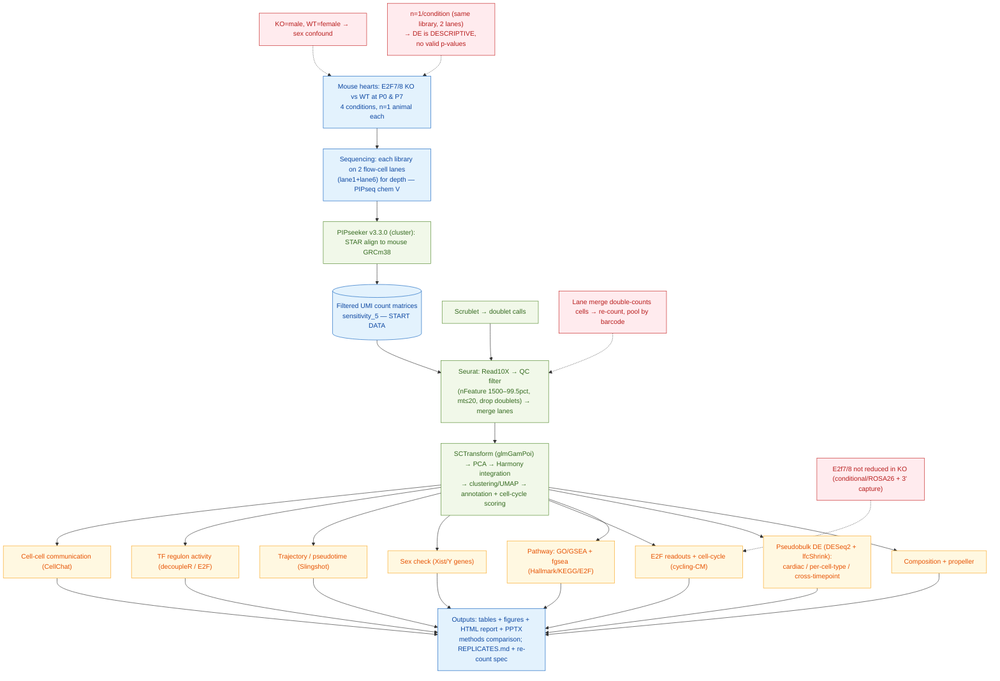

# Flowchart spec — E2F7/8 mouse-heart scRNA-seq pipeline

This file describes the full process (starting data → processing → analysis) in two forms:
**(A)** a copy-paste prompt for an LLM to draw a stylized flowchart, and **(B)** a ready-to-render
Mermaid diagram you can also restyle.

---

## (A) Prompt to give an LLM

> Create a **stylized top-to-bottom flowchart** of the single-cell RNA-seq pipeline below.
> Group the nodes into the numbered **stages** shown (render each stage as a labeled band or swimlane).
> Use **cylinders/parallelograms for data**, **rectangles for processing/analysis steps**, and
> **red callout boxes for the caveats** (attach them near the step they apply to). Flow is sequential
> down the stages; within Stage 6 the analyses branch in parallel from the integrated object.
> Color each stage band a different muted color; make the red caveat callouts stand out.

**STAGE 1 — Biological samples (input).** Mouse hearts, E2F7/E2F8 knockout (KO) vs wild-type (WT),
at postnatal day **P0** and **P7** → 4 conditions: P0WT, P0KO, P7WT, P7KO. **n = 1 animal per condition.**

**STAGE 2 — Sequencing.** Each library was sequenced on **two flow-cell lanes (lane1 + lane6)** to add
depth (Novogene; PIPseq chemistry "V") → 8 raw FASTQ sets. *(Raw FASTQ kept on the compute cluster, not analyzed locally.)*

**STAGE 3 — Upstream processing — done by PIPseeker v3.3.0 on the cluster (we received its outputs):**
- **STAR alignment** of reads to the **mouse GRCm38** reference.
- Cell calling → **filtered UMI count matrices** (genes × cells), at "sensitivity_5", one per lane.
  **← THIS IS THE DATA WE STARTED FROM LOCALLY.** (BAMs/alignments stayed on the cluster.)
- **Scrublet** (Python) → per-cell doublet predictions (`predicted_doublets.csv`).

**STAGE 4 — QC & object construction (R / Seurat).**
- `Read10X` of each lane's filtered matrix → Seurat objects.
- **QC filter:** keep cells with nFeature_RNA ≥ 1500 and ≤ 99.5th-pctile, percent.mt ≤ 20, and remove Scrublet doublets.
- **Merge lane1 + lane6** within each condition.

**STAGE 5 — Normalization, integration, clustering, annotation.**
- **SCTransform** normalization (glmGamPoi).
- Per-condition: PCA → graph clustering → UMAP → cluster markers (`FindAllMarkers`, presto).
- Condition merges (P0 = KO+WT; P7 = KO+WT) and a combined 4-group object → **Harmony integration** → clusters/UMAP.
- **Cell-type annotation** (canonical cardiac markers; SingleR attempted). **Cell-cycle scoring** (S/G2M phase).

**STAGE 6 — Analyses (all KO-vs-WT comparisons are DESCRIPTIVE — see caveats).** Branch in parallel:
- QC & doublet recall (**scDblFinder** vs Scrublet)
- **Composition** (cell-type proportions + **propeller**)
- **Differential expression** — pseudobulk **DESeq2 + apeglm lfcShrink** (cardiomyocyte, per-cell-type, cross-timepoint P0↔P7)
- **Pathway enrichment** — GO/GSEA (`gseGO`) + **fgsea** over Hallmark / KEGG / E2F-target sets + GO ORA
- **E2F readouts** — KO verification, E2F-target de-repression, cycling fraction, ploidy/maturation surrogates
- **Cell-cycle analysis** — phase composition; cycling-cardiomyocyte compartment KO vs WT
- **Sex check** — Xist + Y-chromosome genes
- **Trajectory / pseudotime** — **Slingshot** (cardiomyocyte maturation ordering)
- **TF regulon activity** — **decoupleR** over MSigDB E2F regulons (SCENIC substitute)
- **Cell-cell communication** — **CellChat** (ligand-receptor, KO vs WT per timepoint)

**STAGE 7 — Outputs.** Result tables + figures (`rerun/analysis/`), a self-contained **HTML report** and
**PowerPoint deck**, a **methods comparison** vs the prior analysis, and `REPLICATES.md` + a re-count spec.

**RED CAVEAT CALLOUTS (attach to the indicated stage):**
- *(Stages 1–2)* **n = 1 biological replicate per condition** — lane1/lane6 are the **same library** on two flow-cell lanes (identical Novogene IDs), not separate animals → KO-vs-WT has **no valid p-values; all DE is descriptive.**
- *(Stage 1)* **Sex confound:** KO = male, WT = female (Xist/Y-gene evidence) → genotype is confounded with sex.
- *(Stage 4)* **Lane double-counting:** merging the two lanes counts each cell ~twice at half depth; proper fix = pool reads per barcode (re-count with PIPseeker, both lanes as one sample).
- *(Stages 5–6)* **KO not transcript-confirmed:** E2f7/E2f8 are not reduced in KO (likely a conditional/ROSA26 allele invisible to 3′ scRNA + autorepression).
- *(Stage 6)* **RNA velocity not done** — needs spliced/unspliced counts (cluster BAMs), unavailable locally.

---

## (B) Ready-to-render Mermaid (also restyle-able by an LLM)

