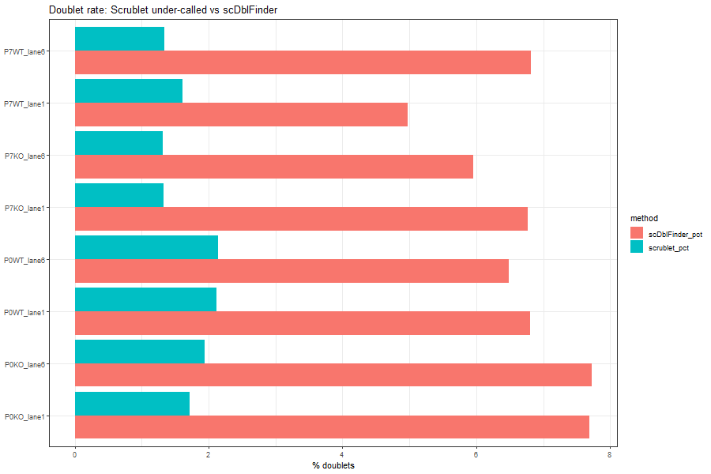
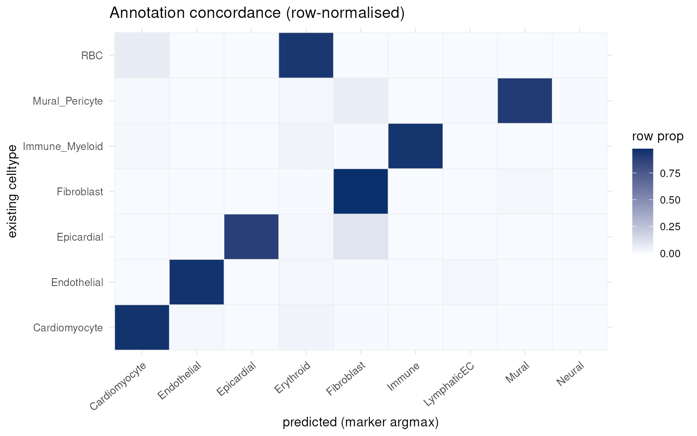
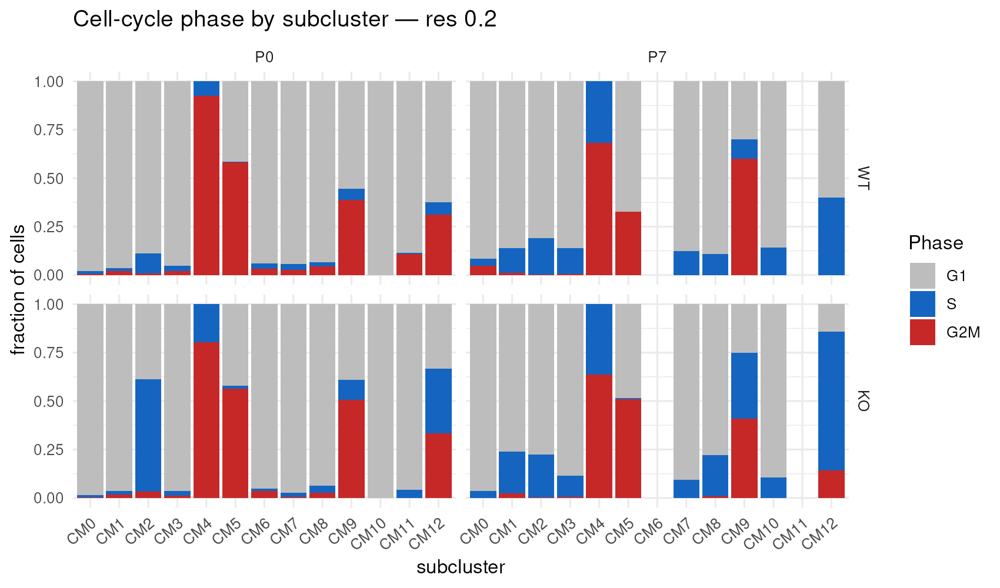

## What this deck covers

- **The data** — what was sequenced, and what one animal per condition permits
- **Every processing step**, with the parameter actually used
- **Why each choice was made**, and what the alternative would have done
- **The platform question** — PIP-seq is not 10x, and what follows from that
- **What I cannot verify** from the code I hold, and how to close it

Detail for every slide is in the accompanying methods book: one chapter per analysis,
every parameter cited to file and line.

::: {.notes}
Frame at the top: this is a descriptive pilot. Its value is hypothesis generation and
candidate ranking. I will be explicit about where a choice could have gone the other
way, and about where I cannot currently show my work because the upstream pipeline lives
in another workspace.
:::

## The experiment

| | |
|---|---|
| Tissue / species | Developing mouse heart, whole-heart dissociation |
| Timepoints | **P0** and **P7** |
| Genotypes | **E2F7/8 double knockout** vs **wild type** |
| Libraries | **4** — WT-P0, WT-P7, KO-P0, KO-P7 |
| Animals | **1 per library** |
| Sequencing | 2 flowcell lanes per library (8 lanes) |
| Enrichment | P7 FACS-sorted for cycling cells; P0 essentially unsorted |
| Cells | 75,020 across the lanes → **30,030** analysed, **21,598** cardiomyocytes |

::: {.notes}
The most important line is "1 animal per library". Everything downstream — the choice of
statistical test, the refusal to quote p-values as significance, ranking by effect size
— follows from it, not from taste.

The two lanes per library are the same library sequenced twice: technical, not
biological, replicates. Anyone who reads the lane count as n=8 will over-read every
result in the project.

Also flag the sort now, because it returns three times later.
:::

## Known defect: nearly every cell is counted twice

The two lanes per library are the same library sequenced twice. Each lane was counted by a
**separate PIPseeker run** and the results merged — so the same cell appears twice, each copy
at about half its true depth.

| Library | lane1 | lane6 | shared | Jaccard |
|---|---|---|---|---|
| P0WT | 11,245 | 11,534 | 11,216 | 0.970 |
| P0KO | 12,011 | 12,045 | 11,973 | 0.991 |
| P7WT | 5,836 | 5,888 | 5,834 | 0.990 |
| P7KO | 8,241 | 8,220 | 8,201 | 0.993 |

**97–100 % overlap.** In the app, the 30,030 "cells" are **22,480 distinct** cells.

::: {.notes}
This is documented by the upstream team in REPLICATES.md and it is not fixed. I did not find
it — they did — but it had never reached the app or any of our documentation, and it is the
most consequential thing in this deck.

Three consequences. Cell counts are about twice their true value. The 1,500-gene filter was
applied to half-depth cells, so it is really more like a 3,000-gene filter and it dropped
cells that would have passed at full depth. And cell-level tests double-count on top of n=1.

Their own impact assessment is measured, not asserted, and it is the reassuring part: the
descriptive DE conclusions are robust, because pseudobulk sums over cells are roughly
conserved whether a cell's reads sit in one row or two. What needs regenerating is cell
counts, QC thresholds, clustering and UMAP, doublet calls, composition, and every per-cell
readout.

So for the lab: fold changes and gene rankings are usable. Composition percentages, cycling
fractions and per-cell scores are not, to the precision they appear to have — and that
includes the cycling fractions behind my sort-artefact slide later.

The fix is specified and needs the cluster: re-run PIPseeker once per library over both
lanes' FASTQs, which dedupes UMIs across lanes, then re-run the Seurat pipeline over 4
libraries instead of 8.
:::

## What we linked instead of recomputing

28 tables the pipeline had already computed, now in the app under **Precomputed results** —
for **+10 MB** on a 634 MB bundle and no new computation.

| Category | Now reachable |
|---|---|
| DE, full data | WT and KO **P7-vs-P0, all CM, every gene, no gate** (20,228 / 20,789) + pseudobulk DESeq2 |
| Communication | A full **CellChat** run with permutation tests |
| Composition | **propeller** abundance tests — a real test where the tab had none |
| Confounds | Sex calls, E2f7/8 KO verification, lane overlap, both doublet callers |
| Annotation | The cluster → cell-type mapping, marker panel, confusion, recall |

Pooled DE tables also un-trimmed: **172,877 → 181,026** rows.

::: {.notes}
Two of these close gaps I had flagged as open in the last version of this deck. The
Cell-cell signalling tab scores 20 curated ligand pairs by hand with no significance test —
and a CellChat run with permutation tests was sitting on disk unused. The cluster-to-celltype
mapping I listed as unrecoverable is now in the bundle.

The un-trim matters for lab use: build_app_data.R dropped genes with baseMean under 3, about
4 percent per table. A gene someone looks up and cannot find reads as "not measured" when the
truth was "expressed too low to store". That is now fixed.

Both dev and prod are deployed with this.
:::

## The platform, answered

**This is PIP-seq with chemistry V, counted by PIPseeker v3.3.0** — not 10x. The upstream
run's own records confirm every step.

| Step | Tool and setting |
|---|---|
| Capture | PIP-seq, `--chemistry V` |
| Counting | **PIPseeker v3.3.0**, `pipseeker full` |
| Alignment | **STAR 2.7.6a**, bundled in PIPseeker |
| Reference | Ensembl **GRCm38** + **GTF release 99** |
| Cell calling | PIPseeker sensitivity — **level 5 used** |
| Doublets | **Scrublet**, `expected_doublet_rate = 0.08` |

::: {.notes}
Open by crediting the folder: all of this became recoverable once the original PIPseeker
outputs came across, and it closes action items 2 and 3 from the version of this deck I
circulated.

Own the earlier error plainly: our own notes said 10x, I took that at face value, it was
wrong. Then move straight to what the correction actually changes — which is one thing,
not three.

Alignment held up well across all eight lanes: 74-76 percent uniquely mapped, about 90
percent to the transcriptome.
:::

## PIP-seq vs 10x: what actually differs

| | PIP-seq | 10x Chromium 3' |
|---|---|---|
| Partitioning | Templated emulsion, **vortex** | Microfluidic droplets |
| Cell barcode | **24 bp** (v2) / **28 bp** (v3–v4), split-pool | **16 bp**, single block |
| UMI | 12 bp | 12 bp |
| Cell recovery | **37.6 %** (v4) · **43.1 %** (PIPseq V) | **71.1 %** (GEM-X) · ~50–55 % (NextGEM) |
| Ambient RNA | < 5 % (**chemistry V**) · > 10 % (v4) | < 5 % |
| Multiplet rate | **3.6 %** (chemistry V) | 10–11.6 % at the loading tested |
| Mitochondrial % | 5.6–5.9 % (chemistry V), highest tested | lower |
| Vendor pipeline | PIPseeker → DRAGEN | Cell Ranger |

::: {.notes}
Numbers from a 2026 seven-platform benchmark in NAR Genomics and Bioinformatics; both
are 3'-biased assays.

Important correction to the version of this deck I circulated: the >10 percent ambient
figure is v4's. We ran chemistry V, which sits under 5 percent with everything else. So the
ambient argument I made there is withdrawn.

Two rows still matter. Multiplets at 3.6 percent, the lowest of the seven platforms, and
mitochondrial content the highest — which is a point in favour of our generous mito
ceiling.
:::

## What the correction actually changes

**One thing, and it is now specific.** Scrublet was run with
`expected_doublet_rate = 0.08` — a 10x-loading prior. This chemistry's measured multiplet
rate is **3.6 %**, less than half that.

- Scrublet still flagged only **1.28–1.34 %** of cells
- scDblFinder flagged **4.97–7.72 %** — above the platform's actual rate
- So **scDblFinder looks mis-calibrated here**, not Scrublet

**Withdrawn:** the ambient-RNA argument — that rested on v4's > 10 % load; chemistry V is
under 5 %.

**Strengthened:** the 20 % mitochondrial ceiling. Chemistry V runs the highest
mitochondrial content of the platforms benchmarked, so a conventional 5–10 % cut would
have been even more damaging than we argued.

::: {.notes}
The honest accounting slide. I made three claims about what the platform correction meant:
one survives, one is withdrawn, and one turns out to support a choice we had already made.
Say it in those words.

The doublet item is cheap and I will close it — re-run both callers at a 0.036 prior and
check whether anything moves. I do not expect it to; the analyses that matter are
per-subcluster contrasts over thousands of cells.
:::

## Cell calling: sensitivity 5, the most permissive level

PIPseeker has no single cell-calling threshold — it emits a **range of sensitivities** and
leaves the choice to the analyst.

| Lane | sens 3 | sens 4 | sens 5 — used |
|---|---|---|---|
| P0KO_lane6 | 8,271 | 9,836 | **12,045** |
| P0WT_lane1 | — | 9,515 | **11,245** |
| P7KO_lane1 | — | 7,069 | **8,241** |
| P7WT_lane1 | — | 4,934 | **5,836** |

::: {.notes}
Sensitivity 5 — the most permissive level computed — was the one used.

On the one lane computed at all three levels the choice moves the cell count by 46 percent.
Level 4 to 5 adds about 20 percent on every lane.

The consequence: a permissive cell call admits more marginal, low-content barcodes, so our
1,500-gene floor is doing the real cell-quality filtering rather than the cell caller.
Those two decisions have to be read as one pipeline, not two independent choices.
:::

## What is still not documented

The upstream **counting** is now fully recorded. What remains outside the repository is the
**re-analysis R pipeline** that turns those matrices into the bundle.

| Still uncited | Where it lives |
|---|---|
| Principal components into neighbours / UMAP | `our_analysis/` |
| Harmony `theta`, `lambda`, iterations | `our_analysis/` |
| UMAP `n.neighbors`, `min.dist`, `metric` | `our_analysis/` |
| Clustering resolution, cluster → cell-type map | `our_analysis/` |
| `SCTransform` `variable.features.n` / `vars.to.regress` | `our_analysis/` |
| The **upper** gene-count cap | `our_analysis/` |
| `NORMALIZATION.md`, `METHODS_COMPARISON.md` | `our_analysis/00_DOCS/` |

::: {.notes}
One folder closes all of this, and the README in the folder we just received names it. A
copy operation, not an investigation.

The lower bound has come off this list: the original merged objects have an nFeature
minimum of exactly 1500, so that threshold is now confirmed at source.
:::

## The barcodes: a retraction

I told you last time that the bundle's 16 bp `AA`-prefixed barcodes meant something had
been renamed upstream, and that the downsample looked alphabetical. **Both were wrong.**

PIPseeker's own `barcodes.tsv.gz` for one lane is 16 bp, **100 %** `AA`-prefixed, spanning
exactly the range I flagged — and its first barcode is `AAAAAAAAAAAGCACT`, the exact
minimum in our bundle.

- PIPseeker **translates** the 24–28 bp combinatorial split-pool barcode into a compact
  16 bp space before writing the matrix
- Our bundle's barcodes are PIPseeker's, **unaltered**
- There is no alphabetical downsample

::: {.notes}
Worth showing rather than quietly fixing. It is the correction that most changes the story
— I had this as evidence of a provenance gap and it turns out to be ordinary vendor
behaviour. It is also a good illustration of why the folder mattered: I could not settle it
from the bundle alone, and I was wrong in the confident direction.
:::

## Did we change the original analysis? Yes — three things

Checked cell by cell, not taken from the hand-off notes. Every cell the original kept can be
looked up in our bundle by barcode and lane.

| Sample | original | − doublets | − mito >20 % | = eligible | − not bundled | = ours |
|---|---|---|---|---|---|---|
| P0KO | 17,522 | 309 | 3 | 17,210 | 8,507 | 8,703 |
| P0WT | 19,460 | 394 | 29 | 19,037 | 9,387 | 9,650 |
| P7KO | 14,222 | 182 | **538** | 13,502 | 6,658 | 6,844 |
| P7WT | 9,734 | 130 | 74 | 9,530 | 4,697 | 4,833 |

Only **1,659** cells were filtered on quality. The other **29,249** were left out of the
browser file — a 50 % downsample, not a quality judgement.

::: {.notes}
Headline first: we re-counted nothing. All 30,030 of our cells are in the original objects,
so both runs read the same PIPseeker matrices.

Lead with the reassuring part: identical starting matrices, so nothing downstream is
explained by a different alignment, reference or cell call.

Then the three changes. One: doublets. Scrublet-flagged cells are retained at exactly zero
percent in ours — not one of 1,015 — against about 50 percent for everything else. The
original flagged them and kept them; we remove them.

Two: the 20 percent mito cap is ours. The original applied no cap at all, and its cells run
up to 36 percent.

Three: a graded upper bound on gene count — retention is flat to about 7,000 genes then
falls away to zero above 10,000, which is the shape of a quantile rule rather than a fixed
threshold. The highest-complexity cell we keep has 9,307 genes.

Everything else is a uniform 50.6 to 50.7 percent downsample in all four samples.

If anyone asks where the other 29,000 cells went — and they should — the answer is the
browser bundle, and it is the next slide.
:::

## The downsample is not free

The bundle is a stratified **~50 %** sample of the post-QC cells, taken so the Shiny app can
hold it in memory. That would be harmless if it only affected what the browser draws. **It
does not** — the four-group DE grids are computed from the bundle.

- `de2` uses all **21,598** bundled cardiomyocytes — about half of the ~43,000 post-QC
- `de` uses the broad matrix's **5,755** — about **13 %** of them

So every arm size is roughly half, or an eighth, of what the experiment yielded.

**But the two questions are separable.** The bundle is 634 MB in memory, and the two display
matrices are **478 MB of that** — the analysis *results* are only 139 MB and do not grow with
cell count. So the browser file can stay small **and** every precomputed contrast can use
every cell: compute upstream on the full object, ship only the tables.

::: {.notes}
This is the most actionable thing in the deck. CM2's KO-P0 arm is 31 cells; at full depth it
would be about 60. Four contrasts are skipped outright. The twelve priority contrasts need two
grids to reach full coverage. A good share of that is the downsample, not the biology.

Why the downsample exists at all: build_app_data.R makes that call and it is not in our
repo, so the reason is not recorded. But the constraint is real — the app holds the whole
bundle in one R process serving every session, and doubling the cells would push it over a
gigabyte, above the shinyapps.io instance memory.

The point to land is that we do not have to choose. build_fourgroup.R already has a --seurat
flag for running over all genes and all cells from the upstream object, and a DE table is the
same size whether 5,000 or 43,000 cells went into it. What is missing is the annotated
post-QC object, in the our_analysis folder.

One honest caveat: the app claims the precomputed cell-type DE tables were computed on the
full data. Those tables carry no per-arm cell counts, so I cannot verify that from the bundle
either way. I am treating it as intent, not fact, until the scripts arrive.
:::

## The mito cap and the mito confound are the same phenomenon

The 20 % ceiling is a fixed number applied to four libraries with different mitochondrial
content — so it removes very different numbers of cells from each.

| Sample | removed by the cap | share of the sample |
|---|---|---|
| P0KO | 3 | 0.0 % |
| P0WT | 29 | 0.1 % |
| P7WT | 74 | 0.8 % |
| **P7KO** | **538** | **3.8 %** |

::: {.notes}
P7KO is the library PIPseeker measured at 9.98 percent mitochondrial against 5 to 7 for the
others, so a fixed ceiling bites hardest there.

Two consequences, and say them together. Our QC partially suppresses the confound by
deleting its most extreme cells — which is why the residual mt- shift in the DE tables,
plus 0.34 log2 in CM1, is smaller than the raw per-library difference. And the surviving
P7KO population is mildly selected on mitochondrial content in a way the other three are
not.

Neither is a reason to raise the cap. It is a reason not to treat the four groups as
symmetrically filtered when reading a marginal result.
:::

## QC filtering

:::: {.columns}
::: {.column width="42%"}
Per lane, keep a cell with:

- **≥ 1,500 detected genes**
- **≤ 20 % mitochondrial reads**
- below an **upper gene-count cap**, to drop likely multiplets
:::
::: {.column width="58%"}

:::
::::

::: {.notes}
1,500 genes is a high floor — 200 to 500 is the usual default. It buys clean
cardiomyocytes and it costs small, low-RNA cells. On a platform with high ambient RNA a
high floor is also doing some of the work an ambient correction would have done: a
defence of the choice, not a reason to skip the correction.

The cap's value is one of the parameters I cannot currently cite.
:::

## Why a 20 % mitochondrial ceiling

:::: {.columns}
::: {.column width="42%"}
The usual default is 5–10 %. We used **20 %**, deliberately.

- Cardiomyocytes at P0–P7 are **genuinely mitochondria-rich** — mitochondrial content
  *is* the maturation phenotype
- A 10 % cut removes the most mature cardiomyocytes: it biases the central analysis
  toward finding nothing
- **The cost:** stressed cells survive, and the per-library mitochondrial difference is
  partly this bill
:::
::: {.column width="58%"}

:::
::::

::: {.notes}
The clearest case in the deck of a threshold set for a tissue-specific reason rather than
by convention, and of a choice whose cost we can name. If pushed: the alternative removes
the signal, and we handle the cost downstream by flagging the mitochondrial block
explicitly rather than by pretending it is not there.
:::

## Doublets: two callers, a four-fold disagreement

:::: {.columns}
::: {.column width="42%"}
- **Scrublet:** 1.31 – 2.14 % per lane
- **scDblFinder:** 4.97 – 7.72 % per lane
- Both ship in the bundle; doublets were removed before analysis
- On **10x** priors (~8 %), scDblFinder looked right
- On **PIP-seq** priors (~3.6 %), **that reading may invert**
:::
::: {.column width="58%"}

:::
::::

::: {.notes}
Be straightforward: I cannot settle this today, and it is one of the two things the
platform correction actually changes. The fix is cheap — re-run both callers with the
expected rate set from the correct platform and chemistry, and check whether anything
moves. My expectation is that nothing does, because the analyses that matter are
per-subcluster contrasts over thousands of cells.
:::

## Normalisation

:::: {.columns}
::: {.column width="42%"}
**SCTransform** with **glmGamPoi**; ~**2,000** highly variable genes drive the
dimensionality reduction.

**Mitochondrial percent deliberately NOT regressed out** — in a tissue where
mitochondrial content is the phenotype, regressing it out removes signal, not noise.
:::
::: {.column width="58%"}

:::
::::

::: {.notes}
The "not regressed" decision is the one to defend hardest, and it is easy: the metabolic
maturation score is built from oxidative-phosphorylation genes. Regressing out
mitochondrial fraction would have regressed out the dependent variable.

Why SCTransform over log-normalisation: it handles the depth variation between these
libraries better, and depth differs substantially between P0 and P7 here.
:::

## Integration, and the trap in it

:::: {.columns}
::: {.column width="42%"}
Four libraries integrated with **Harmony**, then clustered and embedded.

**With one animal per library, library identity and genotype are the same variable.**

- Integrating over libraries also integrates over genotype
- Some real genotype difference is removed **by construction**
- So the UMAP is for **orientation, not measurement**
:::
::: {.column width="58%"}

:::
::::

::: {.notes}
The subtlest methodological point in the deck, and the one a reviewer would go for. The
mitigation is real and worth stating: we never quantify a genotype effect from the
embedding. Clusters are used as strata within which expression is compared — a
legitimate use of an integrated space. Every KO-vs-WT number is computed on expression
values.
:::

## Clustering and cell-type annotation

:::: {.columns}
::: {.column width="45%"}
Seven types by canonical marker panels; cardiomyocytes are **68.7–78.8 %** of cells.

**Independent check:** score each cell against nine published marker panels, take the
argmax, cross-tabulate.

- Cardiomyocyte **95.7 %** concordant
- Endothelial **95.7 %** · Epicardial **89.2 %**
- Largest off-diagonal: **2.5 %** of CMs called Erythroid → **ambient haemoglobin**
:::
::: {.column width="55%"}

:::
::::

::: {.notes}
The annotation itself was done upstream and I cannot show its marker-to-cluster mapping —
the concordance check is what I can show, and it is reassuring at the resolution we use
the labels for.

The 2.5% erythroid mis-call is the platform issue showing up somewhere concrete.
:::

## Cardiomyocyte subclustering

:::: {.columns}
::: {.column width="45%"}
Re-clustered on their own at **resolution 0.2** — 13 subclusters, CM0–CM12. 0.1 and 0.3
exist in the bundle; only 0.2 is exposed.

- With n = 1 the binding constraint is **cells per arm**, not resolution
- At 0.3 more arms fall under the 10-cell floor than the resolution gained is worth
- One exposed resolution stops a 0.2 result being compared with a 0.3 result

**CM4 has no G1 cells; CM6 no P7 cells; CM12 is 9 cells.**
:::
::: {.column width="55%"}

:::
::::

::: {.notes}
The "only one resolution" decision prevents a specific error rather than hiding work. If
someone wants 0.3 it is in the bundle and one line away.
:::

## The knockout is not visible in the transcript — if anything, higher

| Gene | Group | % of cells detected |
|---|---|---|
| E2f8 | WT-P7 | 6.62 % |
| E2f8 | **KO-P7** | **10.2 %** |
| E2f7 | WT-P7 | 6.64 % |
| E2f7 | **KO-P7** | **9.72 %** |

::: {.notes}
The headline: E2f7/E2f8 mRNA is not reduced in the knockout — at P7 it is slightly
higher.

Three explanations, and this dataset cannot separate them. One: a conditional allele that
a 3'-biased assay cannot see — most likely, and PIP-seq is 3'-biased too, so the platform
correction does not rescue it. Two: incomplete recombination — but that predicts no
difference, not a higher signal. Three: a label or sample error, which nothing in the
data excludes.

Say this early in the discussion rather than late. It reframes every downstream result as
"the animal labelled KO versus the animal labelled WT". It is also the strongest argument
for confirming genotype at the protein or gDNA level before any of this is written up.
:::

## The sort artefact: measured, not assumed

:::: {.columns}
::: {.column width="45%"}
P7 was FACS-enriched for cycling cells at a quoted **4.5–5.2×**; P0 was not.

Measured **inside the cardiomyocyte compartment**:

- WT-P0 — **83.7 %** G1 → 16.3 % cycling
- WT-P7 — **75.0 %** G1 → 25.0 % cycling
- That is **1.53×**, not 4.5–5.2×

Every temporal contrast runs in two strata; they agree at **r = 0.99**, median absolute
difference **0.001 log2**.
:::
::: {.column width="55%"}

:::
::::

::: {.notes}
The slide I would most like people to remember, because it is the template for how this
project treats a confound: do not inherit a number from project lore, measure it in the
data you actually have, then show that the correction you built does not change the
answer. The G1 stratification stays as cheap insurance, but the raw tables are fine and
we say so instead of telling people to distrust them.
:::

## The mitochondrial block, and what it costs

`mt-` genes are up in the KO in **all seven** tested subclusters and down in **none**.
Seven independent populations do not agree that cleanly by biology.

- In CM1 the mitochondrial share of signal goes **1.35 % → 1.71 %** (WT-P7 → KO-P7) =
  **+0.34 log2**, matching the `mt-` genes' own fold changes
- The reciprocal squeeze on every other gene is **−0.005 log2** — fifty times below
  threshold, so the rest of the table is unaffected
- **But it owns the KO-up result.** Dropping `mt-` from input *and* universe:
  CM1 KO-**up** goes from **61 GO terms to 0**; CM1 KO-**down** keeps **422 of 423**

**And it is there in the libraries as sequenced.** PIPseeker's own per-lane figure: P0WT
**6.00 %**, P0KO **5.06 %**, P7WT **7.20 %**, P7KO **9.98 %** — KO lower at P0, higher at
P7, the same shape as our downstream measurement, before any of our filtering.

::: {.notes}
This is the strongest single result to come out of the upstream folder. The mitochondrial
confound is not something our pipeline introduced, and it is not an ambient-RNA artefact —
it is a difference between the four libraries as sequenced, confirmed independently by the
vendor pipeline's own metric, with the two lanes of each library agreeing to 0.03 points.

So the KO-down enrichment stands on its own, and the KO-up oxidative-phosphorylation
headline should be treated as a library artefact until a replicated cohort says otherwise.
:::

## Downstream analysis, in one slide

- **Differential expression** — cell-level Wilcoxon (`presto`), because n = 1 gives a
  parametric model no dispersion to estimate. Effect size ranks; p-values do not test
- **Four-group design** — WT/KO × P0/P7 within each subcluster, 4 contrasts × 2 phase
  strata = **77 DE tables**, plus a second grid for gene/cell coverage
- **Enrichment** — GO + GSEA per contrast *and direction*, universe recomputed from the
  matrix (~11,000 genes, not the ~3,000 a row-gated table would supply)
- **Module scores and gene axes** — AUC-based, not log2FC-based: `presto`'s log2FC scales
  with expression level and cannot classify sparse cell-cycle genes

::: {.notes}
Keep this short in delivery. Its purpose is to show the same discipline was applied
downstream and to point at where the detail lives, not to re-run those debates in a
meeting about QC.
:::

## Action items

| # | Item | Owner |
|---|---|---|
| 1 | ~~Confirm platform, chemistry, counting tool + version~~ | **closed** |
| 2 | ~~Confirm cell-calling method and setting~~ | **closed** — sensitivity 5 |
| 3 | Retrieve `our_analysis/` (PCs, Harmony, UMAP, resolution) + `NORMALIZATION.md` | Justin |
| 4 | Re-run doublet calling at a **0.036** prior, not 0.08 | Justin |
| 5 | ~~Evaluate ambient RNA correction~~ | dropped — chemistry V is < 5 % |
| 6 | Confirm nothing downstream came through the **MAESTRO** path | ask the analyst |
| 7 | Confirm the genotype at **protein or gDNA** level | Wet lab |
| 8 | Record an environment snapshot (`renv.lock` / `sessionInfo`) | Justin |

::: {.notes}
Two items closed since the last version, both because the upstream folder arrived. Item 3
is now a copy operation. Item 6 is the only one needing someone else in the room.

Item 7 is the one that most changes what this dataset can claim, and it is a bench
experiment, not an analysis.
:::

## Lijuan — E2F7/8 target-gene strategy

*Placeholder for Lijuan's section.*

::: {.notes}
Hand over here.
:::

## Where the two halves meet

Data-side hooks available if useful:

- a curated **29-gene E2F target panel**, and E2F-family **regulon activity** per cell
  type × timepoint
- **gene-set overlap testing** against the tested gene space — hypergeometric, with the
  universe handled explicitly rather than by eye

::: {.notes}
Offer the machinery rather than proposing conclusions: whatever target list Lijuan's
strategy produces can be crossed against our contrasts with a proper universe and an
expectation under chance, instead of eyeballing a Venn.
:::
